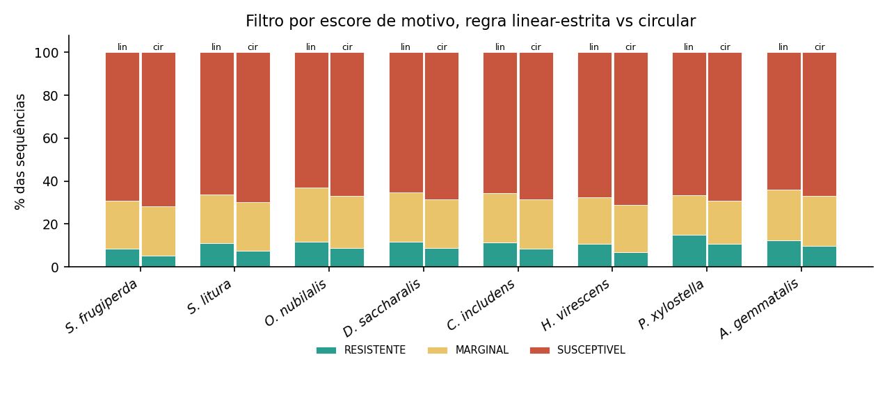

# Documento de leitura e avaliação manual

**Manuscrito:** From Natural Protease Inhibitors to De Novo Peptide Inhibitors Targeting Digestive Trypsins of Lepidopteran Pests
**Destino:** *Frontiers in Natural Products* (Frontiers) — seção *Informatics and Computational Methods*
**Versão em português para leitura interna.** O texto para submissão é o manuscrito em inglês (`manuscript/manuscript.md`); esta tradução mantém os números idênticos, com vírgula decimal e ponto de milhar, e os rótulos de classe (RESISTENTE, MARGINAL, SUSCEPTIVEL) do código. As referências permanecem em inglês, como exige a revista.

## Como ler as marcações

- Trechos em **amarelo** marcam o que ainda depende de simulações em andamento ou de informação dos autores.
- Nada nesta versão foi inventado para preencher lacunas: os resultados do co-dobramento nas duas frentes e das simulações de 10 ns (Seções 3.8–3.10) e as frases que deles dependem estão pendentes.

## Painel de conformidade com as métricas da revista

| Requisito | Limite / padrão | Situação atual | Estado |
|---|---|---|---|
| Tipo de artigo | Original Research (IMRaD: Resumo, Introdução, Material e métodos, Resultados, Discussão) | Estrutura cumprida | OK |
| Extensão do texto principal | ≤ 12.000 palavras (Original Research; página oficial de tipos de artigo da revista, conferida em 30/09/2026) | 7,166 palavras no original em inglês (corpo sem tabelas, títulos e legendas; cada citação contada como uma palavra); tradução: 7,776 | OK (há margem para as Seções 3.8–3.10) |
| Resumo | ≤ 350 palavras (convenção da Frontiers; a página da revista não especifica o número) | 337 palavras no original em inglês sem o trecho pendente (≈ 346 com ele preenchido); tradução: 382 | OK |
| Palavras-chave | 5–8 (diretrizes gerais da Frontiers) | 8 | OK |
| Título | informativo e conciso; sem limite de caracteres na página da Frontiers | título oficial definido pelos autores, 113 caracteres | OK |
| Título curto | ≤ cerca de 50 caracteres (prática da Frontiers; não especificado na página) | 43 caracteres | OK |
| Figuras | 300 dpi no tamanho final; TIFF, JPEG ou EPS; RGB | 8 figuras + 2 suplementares em PNG, TIFF (LZW) e PDF vetorial a 300 dpi, largura 180 mm, RGB; as figuras dos resultados pendentes (Seções 3.8–3.10) ainda serão geradas | pendente |
| Tabelas | editáveis, com legenda | 4 tabelas | OK |
| Referências | autor-ano (Harvard), seis primeiros autores e "et al.", com DOI | 69 referências, todas com metadados conferidos no Crossref/PubMed; nenhuma citada sem estar na lista, nenhuma na lista sem ser citada | OK |
| Declaração de disponibilidade de dados | obrigatória | seção criada; falta confirmar visibilidade do repositório e DOI de arquivamento | pendente |
| Contribuições dos autores, financiamento, conflito de interesses, agradecimentos | obrigatórios | seções criadas, conteúdo a completar pelos autores | pendente |
| Declaração de uso de IA generativa | deve ser reconhecida nos agradecimentos (diretrizes da Frontiers) | rascunho factual na seção Agradecimentos, a ser confirmado pelos autores | pendente |
| Declaração de ética | exigida para estudos com animais ou humanos | seção criada: não se aplica | OK |
| Lista de autores e afiliações | obrigatória | não preenchida | pendente |
| Adequação ao escopo | seção *Informatics and Computational Methods* existe na revista | o título destaca inibidores naturais como moldes e padrões de calibração, mas o trabalho projeta peptídeos *de novo* e é só computacional; a revista pode exigir validação experimental | risco a verificar com o editor |

**Fonte e certeza dos limites.** Conferidos em 30/09/2026 nas páginas oficiais da Frontiers: extensão máxima de 12.000 palavras para *Original Research* na *Frontiers in Natural Products*; 5–8 palavras-chave; figuras a 300 dpi no tamanho final em TIFF, JPEG ou EPS; referências autor-ano com os seis primeiros autores; uso de IA generativa a ser reconhecido. **Não especificados nessas páginas:** limite de palavras do resumo (350 é a convenção da Frontiers, vista em outras revistas do grupo), limite de caracteres do título, número máximo de figuras/tabelas para *Original Research* e o tamanho do título curto. Confirme esses quatro pontos no sistema de submissão antes de enviar.

## Estado dos cálculos (30/09/2026, noite)

| Etapa | Estado | Resultado até aqui |
|---|---|---|
| Painel de 8 espécies e subsítios S1–S3' | concluído | TM-score 0,946–0,957 nos 20 pares |
| Calibração da escada de escores | concluída | Boltz-2 10/10 pares; RMSD do ligante 9/10; MM-GBSA 4/10 (ρ = −0,93 com o tamanho da interface) |
| Geração (RFdiffusion + ProteinMPNN) | concluída | 880 esqueletos, 22.066 sequências únicas |
| Triagem por escore de motivos | concluída | 1.829 semelhantes a resistentes |
| E0 · critério duro de não clivabilidade | concluído | 527 lineares (frente L) e 543 cíclicas (frente M) |
| E1 · Boltz-2 nas duas frentes | concluído (1.070/1.070) | reprodutibilidade entre rodadas ρ = 0,57; linear × cíclico ρ = 0,50 (Seção 3.8, Figura 8) |
| E2 · reescore dos 10 melhores por espécie (5 amostras × 3 sementes) | **em curso** | frente L: semente 1 completa, semente 2 em andamento; frente M ainda não iniciada |
| Escolha da estrutura inicial (melhor amostra que passa no QC de pose) | pendente | implementada e testada; roda após o E2 |
| E3 · controles embaralhados pareados | pendente | 234 controles por frente preparados |
| E4 · QC de pose e matriz cruzada 8 × 8 | pendente | QC já testado nas predições do E1 (18% passam na amostra única) |
| E6–E7 · MD de 10 ns (3 melhores por espécie e frente, 48 simulações) | pendente | topologia cíclica validada (C–N 1,34 Å; ω −179°) |
| E8–E9 · comparação linear × macrociclo e lista para a MD longa | pendente | scripts prontos |
| E5 · contratriagem frente a proteases não-alvo | não construída | sem ela, nenhuma seletividade é afirmada |

**Estimativa:** o restante do pipeline deve levar de 2 a 3 dias de GPU compartilhada; a MD de 10 ns das duas frentes (48 simulações) é a etapa mais longa.

**Incidentes de execução já corrigidos (para transparência):** (i) o pré-processamento do Boltz travou duas vezes sem erro (no E1 e no E2) e uma predição foi pulada por um erro intermitente; o pipeline agora usa 1 thread de pré-processamento, limite de 50 min por lote e repetição automática das predições faltantes; (ii) o teste de quiralidade do controle de pose estava invertido; foi corrigido antes de qualquer uso nos resultados, e a taxa de 18% citada acima já é a corrigida.

## Pendências antes da submissão

1. Seções 3.8–3.10 (E1–E4 e dinâmica molecular de 10 ns nas duas frentes), frase correspondente no Resumo e na Seção 4.1: dependem de cálculos em andamento ou ainda não disparados no servidor.
2. Figuras de ocupância de S1, de integridade do anel e da comparação linear × macrociclo, a gerar quando as simulações terminarem.
3. Lista de autores, afiliações, contribuições, financiamento, conflito de interesses, declaração de IA generativa e DOI de arquivamento do código.
4. Decisão dos autores: refazer o desenho de sequências com o receptor fixo e permitindo um P1 básico (Seção 4.4 iv e 4.5).

# De inibidores naturais de proteases a inibidores peptídicos *de novo* dirigidos às tripsinas digestivas de lepidópteros-praga

**Título curto:** Inibidores peptídicos *de novo* de tripsinas de pragas

**Autores:** [LISTA DE AUTORES A COMPLETAR]{custom-style="Pendente"}  
**Afiliações:** [A COMPLETAR]{custom-style="Pendente"}  
**Correspondência:** [A COMPLETAR]{custom-style="Pendente"}

**Tipo de artigo:** Original Research — seção *Informatics and Computational Methods*  
**Palavras-chave:** inibidores naturais de proteases, desenho peptídico *de novo*, tripsina digestiva, Lepidoptera, *Anticarsia gemmatalis*, resistência proteolítica, RFdiffusion, Boltz-2

---

## Resumo

**Introdução:** Inibidores vegetais de proteases podem prejudicar lepidópteros-praga, mas são grandes, e os peptídeos curtos derivados de suas alças do centro reativo inibem as tripsinas digestivas apenas em concentrações submilimolares a milimolares. Não se sabe se inibidores naturais podem orientar o desenho peptídico *de novo*, nem se escores de aprendizado profundo ordenam peptídeos curtos desenhados que o intestino da lagarta não degrade. **Métodos:** Para oito lepidópteros-praga da soja, entre eles *Anticarsia gemmatalis*, complexos cristalográficos de inibidores naturais definiram os subsítios catalíticos, transferidos para modelos do AlphaFold; uma escada de escores (co-dobramento com Boltz-2, dinâmica molecular, MM-GBSA) foi calibrada com seis inibidores naturais e iscas embaralhadas; e 22.066 sequências peptídicas foram desenhadas *de novo* sobre esqueletos macrocíclicos cabeça-cauda (RFdiffusion, ProteinMPNN). As sequências foram triadas por um escore de motivos e por um critério duro de não clivabilidade (nenhum resíduo P1 de proteases do intestino médio do tipo tripsina, quimotripsina ou elastase); as sobreviventes são co-dobradas com o Boltz-2 e simuladas por 10 ns em pH 10,0 como peptídeos lineares e como macrociclos. **Resultados:** Os subsítios foram transferidos nos 20 pares receptor–molde (TM-score 0,946–0,957). O Boltz-2 pontuou o inibidor natural acima de sua isca embaralhada em 10 de 10 pares, e o RMSD do ligante em 9 de 10, enquanto o MM-GBSA o fez em 4 de 10 e acompanhou o tamanho da interface (ρ = −0,93). A triagem por motivos reteve 1.829 sequências (confiança do Boltz-2 0,862, dentro da faixa de uma isca embaralhada de SFTI-1, 0,944). O critério duro reteve 527 sequências lineares e 543 cíclicas (2,4–2,5%), 49% glicina, com 9 de 4.060 resíduos lisina ou arginina, cada um antes de prolina. Repetir o Boltz-2 em entradas idênticas deu correlação de postos de 0,57 entre rodadas (n = 442), próxima dos 0,50 entre as formas linear e cíclica da mesma sequência (n = 527). [PENDENTE: controles pareados, controle de qualidade de pose e simulações de 10 ns.]{custom-style="Pendente"} **Conclusões:** Os inibidores naturais serviram bem como moldes estruturais e padrões de calibração, mas a confiança do Boltz-2 sustenta apenas comparações pareadas e o MM-GBSA de uma única trajetória não deve ordenar esses complexos. Exigir não clivabilidade seleciona peptídeos curtos e ricos em glicina, sem os resíduos favorecidos em P1 pela tripsina, o que explicita o compromisso entre resistência proteolítica e engajamento de S1. Todos os resultados são computacionais; a seletividade e a atividade inibitória não foram testadas.

---

## 1 Introdução

As lagartas de lepidópteros estão entre os principais fatores bióticos que limitam a produtividade da soja na América do Sul, e a lagarta-da-soja *Anticarsia gemmatalis* é uma das espécies desfolhadoras desse grupo (Carpane et al., 2022; de Almeida Barros et al., 2021). Nas larvas de lepidópteros, a digestão de proteínas ocorre em um lúmen do intestino médio fortemente alcalino; o intestino médio dos lepidópteros gera o maior pH luminal conhecido em um sistema biológico (Dow, 1992). As enzimas do tipo tripsina são as principais proteases do intestino médio de *A. gemmatalis* (de Almeida Barros et al., 2021), e as serino-proteases são a principal classe de proteases expressa em larvas de quinto ínstar (da Silva Júnior et al., 2020); um levantamento proteômico do intestino larval identificou 54 proteínas de proteases expressas, o que indica múltiplas isoformas (Silva-Júnior et al., 2021). Revisões gerais sobre a digestão em insetos descrevem a compartimentalização e as propriedades dessas enzimas (Terra e Ferreira, 1994).

As plantas se defendem dos herbívoros com inibidores proteicos de proteases, muitos deles acumulados nas sementes, e esses inibidores têm sido examinados como modelos para o controle de pragas. Exemplos relevantes para as tripsinas de *A. gemmatalis* incluem o inibidor de sementes de *Adenanthera pavonina* (ApTI), inibidor não competitivo de ligação forte das tripsinas larvais (Meriño-Cabrera et al., 2020), e os inibidores pancreático bovino (BPTI) e de Kunitz da soja, que reduziram a sobrevivência larval com efeitos distintos sobre a resposta proteolítica do inseto (de Almeida Barros et al., 2022). No extremo inferior da faixa de tamanho, o peptídeo cíclico SFTI-1, de 14 resíduos, de sementes de girassol, inibe a tripsina com K~i~ de 100 pM, e sua potência foi atribuída à rigidez conferida pela ciclização e por uma única ligação dissulfeto (Luckett et al., 1999). Uma limitação recorrente é a adaptação dos insetos: as larvas compensam induzindo atividade de protease insensível ao inibidor (Jongsma et al., 1995; Jongsma e Bolter, 1997), regulando a expressão de múltiplas proteases digestivas (Kuwar et al., 2015; Lomate et al., 2018) e, em algumas espécies, por expansão de famílias gênicas que pode explicar diferenças de sensibilidade a inibidores da soja entre *Spodoptera frugiperda* e *Diatraea saccharalis* (Souza et al., 2016).

Os inibidores naturais também ficam expostos ao intestino médio do inseto, onde podem ser degradados ou contornados, e peptídeos derivados de suas alças do centro reativo (RCLs) foram propostos como alternativas menores e mais estáveis (Paulo et al., 2026). Peptídeos sintéticos curtos que imitam a alça do centro reativo desses inibidores despertaram por isso interesse, porque são mais baratos de produzir do que proteínas. Peptídeos lineares derivados da interface de um complexo entre um inibidor de Kunitz e a tripsina inibiram tripsinas digestivas de *Spodoptera cosmioides* e foram tóxicos para as larvas (Meriño-Cabrera et al., 2020). Tripeptídeos derivados de inibidores Pin-II inibiram proteases do intestino médio de *Helicoverpa armigera*, com eficácia maior em pH alcalino do intestino (Saikhedkar et al., 2018), e peptídeos bicíclicos construídos a partir das mesmas alças foram dez vezes mais potentes do que seus equivalentes lineares (Saikhedkar et al., 2019). Em *A. gemmatalis*, os tripeptídeos desenhados GORE1 e GORE2 são inibidores competitivos reversíveis, com K~i~ de 0,49 e 0,10 mM, respectivamente, e prejudicam a sobrevivência e o desenvolvimento larval (de Almeida Barros et al., 2021); seus complexos foram examinados por dinâmica molecular (de Almeida Barros et al., 2022), e dipeptídeos contendo arginina, previstos *in silico* como ligantes mais fortes do subsítio S1 das tripsinas de *A. gemmatalis* do que peptídeos com lisina, foram inibidores competitivos *in vitro* (Meriño-Cabrera et al., 2022). Peptídeos inspirados nas alças do centro reativo do BPTI e do inibidor de Kunitz da soja foram inibidores competitivos de proteases do tipo tripsina de *A. gemmatalis* (Paulo et al., 2026), e GORE1 e GORE2 também inibiram proteases do tipo tripsina de *S. frugiperda* (Schultz et al., 2026). Os tripeptídeos GORE têm K~i~ de 0,10–1,41 mM contra proteases do tipo tripsina de *A. gemmatalis* e *S. frugiperda* (de Almeida Barros et al., 2021; Schultz et al., 2026), o que deixa espaço para desenhos de maior afinidade e mais estáveis; um desenho guiado por estrutura de um peptídeo derivado de interface contra tripsinas de *S. frugiperda* também foi descrito (Severiche-Castro et al., 2026).

Os inibidores canônicos ("de mecanismo padrão") ligam-se por uma alça exposta de conformação conservada, cujo resíduo P1 se insere no bolso S1 (Laskowski e Kato, 1980; Laskowski e Qasim, 2000); o restante da molécula, o arcabouço, melhora a ligação em cerca de seis ordens de grandeza e protege o inibidor da proteólise (Kelly et al., 2005). Nas enzimas do tipo tripsina, o bolso S1 é definido por um aspartato na posição numerada 189 na quimotripsina, que favorece lisina e arginina em P1 (Perona e Craik, 1995; Hedstrom, 2002); as enzimas do tipo tripsina de *A. gemmatalis* também mostram maior afinidade por substratos com arginina em P1 (Patarroyo-Vargas et al., 2017). Isso cria uma tensão de desenho que é central para este estudo: os resíduos básicos de P1, que melhor engajam o S1, são eles próprios sítios de clivagem da enzima-alvo.

Um peptídeo que o intestino da lagarta cliva não chega intacto ao alvo, de modo que a estabilidade proteolítica é um requisito e não uma otimização. O intestino médio de lepidópteros contém, além das enzimas do tipo tripsina, endopeptidases do tipo quimotripsina e elastase e exopeptidases: tripsina luminal, elastase e uma leucina aminopeptidase da borda em escova foram purificadas da mariposa-cigana (Valaitis, 1995), proteinases do intestino médio de outro lepidóptero foram caracterizadas em detalhe (Valaitis et al., 1999), enzimas do tipo quimotripsina foram clonadas de *D. saccharalis* (Yang et al., 2012) e de *S. litura* (Zhan et al., 2010), e atividades de carboxipeptidase A e de aminopeptidase foram medidas no intestino médio de uma lagarta de borboleta (Nakonieczny et al., 2007). Uma sequência que evite os resíduos P1 dessas enzimas (lisina e arginina para a tripsina, resíduos aromáticos e alifáticos grandes para as enzimas do tipo quimotripsina, alifáticos pequenos para as do tipo elastase) e, em um peptídeo linear, um C-terminal clivável, resistiria em princípio a todas elas, embora a especificidade de cada enzima em cada uma de nossas espécies não tenha sido medida. A ciclização cabeça-cauda é uma via complementar, porque um macrociclo não tem extremidades livres sobre as quais as exopeptidases possam agir; as formas linear e cíclica da mesma sequência podem assim ser comparadas sob o mesmo requisito.

Métodos de aprendizado profundo permitem hoje gerar *de novo* peptídeos e outros ligantes. O RFdiffusion gera esqueletos condicionados a um alvo (Watson et al., 2023), o ProteinMPNN atribui sequências aos esqueletos (Dauparas et al., 2022), macrociclos cabeça-cauda podem ser desenhados com essas ferramentas (Rettie et al., 2025), e modelos de co-dobramento como Boltz-1 e Boltz-2 predizem complexos biomoleculares (Wohlwend et al., 2024; Passaro et al., 2025). Não está estabelecido se os escores de confiança desses modelos ordenam de forma significativa candidatos peptídicos curtos contra proteases de insetos, e os métodos de energia livre de ponto final são sabidamente sensíveis à amostragem e ao tipo de sistema (Hou et al., 2011; Genheden e Ryde, 2015; Xu et al., 2025). Uma campanha de desenho contra proteases de insetos precisa, portanto, de uma calibração explícita das etapas de escore em que se apoia.

Perguntamos aqui até onde os inibidores naturais podem ser levados a inibidores peptídicos *de novo*. Eles fornecem os moldes estruturais (os complexos tripsina–inibidor que definem os subsítios), os padrões de calibração e a lógica de projeto P1–S1; ao desenho *de novo* cabe fornecer o que lhes falta, a saber, o tamanho pequeno e a ausência de motivos de clivagem. Apresentamos um pipeline computacional que (i) define os subsítios catalíticos das tripsinas digestivas de oito lepidópteros-praga por transferência estrutural a partir de complexos cristalográficos de inibidores naturais, (ii) calibra uma escada de escores contra seis inibidores naturais e iscas embaralhadas, (iii) gera esqueletos macrocíclicos cabeça-cauda de 5–20 resíduos com RFdiffusion e ProteinMPNN, (iv) aplica uma triagem por escore de motivos e um critério duro de não clivabilidade e (v) co-dobra as sobreviventes com o Boltz-2 e as tria por dinâmica molecular de 10 ns, em duas frentes: as sequências desenhadas como peptídeos lineares e como macrociclos cabeça-cauda. Uma visão geral é dada na Figura 1. O trabalho é inteiramente computacional. Não avalia a seletividade frente a proteases não-alvo, que é um módulo separado do nosso projeto, e nenhum resultado aqui relatado deve ser lido como evidência de atividade inibitória ou de seletividade.

![**Figura 1.** Visão geral do pipeline. Verde: concluído; amarelo: em execução; cinza: pendente. Oito receptores com subsítios transferidos e uma escada de escores calibrada precedem a geração de 22.066 sequências; o critério duro de não clivabilidade (E0) as divide na frente L (linear, 527) e na frente M (macrociclo, 543), cada uma seguida de co-dobramento com o Boltz-2 (E1), reescore com controles pareados (E2–E3), controle de qualidade de pose (E4), simulações de 10 ns dos três melhores por espécie (E6–E7) e comparação e lista de entrega (E8–E9). A contratriagem frente a proteases não-alvo (E5) não foi construída e nenhuma seletividade é afirmada.](figures/pt/fig1_pipeline_v3.png){width=16.5cm}

---

## 2 Material e métodos

### 2.1 Painel de alvos e estruturas dos receptores

O painel compreende serino-proteases digestivas do tipo tripsina de oito lepidópteros-praga (*Spodoptera frugiperda*, *S. litura*, *Ostrinia nubilalis*, *Diatraea saccharalis*, *Chrysodeixis includens*, *Heliothis virescens*, *Plutella xylostella* e *Anticarsia gemmatalis*), de *Manduca sexta* como espécie de referência com evidência curada de intestino médio, e de *Bombyx mori*, que foi mantida no painel mas não usada como alvo de desenho. Somente *M. sexta* (UniProt P35045–P35047) tem entradas revisadas anotadas com expressão no intestino médio; para as demais espécies as entradas não são revisadas e foram selecionadas por homologia, de modo que o painel se apoia em evidência de sequência e de estrutura, e não em expressão documentada no intestino médio. As estruturas são modelos AlphaFold monomer v2.0 (Jumper et al., 2021) obtidos do AlphaFold Protein Structure Database (Varadi et al., 2024) (códigos de acesso na Tabela 1). A identidade de sequência com a tripsina alcalina B de *M. sexta* (P35046) foi calculada com o Biopython (Cock et al., 2009) por alinhamento global (BLOSUM62, abertura de lacuna −11, extensão −1; posições idênticas divididas pelo comprimento da sequência mais curta), e a confiança por modelo é o pLDDT médio dos átomos Cα, lido da coluna do fator B.

Como o UniProt nomeia a maioria dessas entradas como "Chymotrypsin" (anotação automática), a especificidade do tipo tripsina foi verificada a partir da sequência. O resíduo de especificidade foi localizado seis resíduos antes (extremo N-terminal) da serina catalítica, um deslocamento calibrado em duas proteínas de referência do UniProt (UniProt Consortium, 2025): tripsina bovina (P00760; Ser200 catalítica, Asp na posição 194 do precursor) e quimotripsinogênio A bovino (P00766; Ser195, Ser na posição 189). A serina catalítica de cada sequência do painel foi encontrada pelo motivo conservado G[DN]SGG[PT].

### 2.2 Definição e transferência dos subsítios catalíticos

Os subsítios foram definidos a partir de dois complexos cristalográficos de tripsina bovina obtidos do Protein Data Bank (Berman et al., 2000): tripsina–BPTI (2PTC, cadeia E da tripsina) e tripsina–SFTI-1 (1SFI, cadeia A da tripsina; Luckett et al., 1999). Em cada complexo, o resíduo do inibidor cujo carbono carbonílico fica mais próximo do Oγ de uma serina da cadeia da tripsina foi tomado como P1 (2,68 Å para 2PTC e 2,83 Å para 1SFI; uma distância acima de 4,5 Å teria reprovado o controle de qualidade). Os sete resíduos do inibidor P4–P3′ (nomenclatura de Schechter–Berger; Schechter e Berger, 1967) definem S4–S3′, e um resíduo da tripsina foi atribuído a um subsítio quando qualquer de seus átomos ficava a menos de 4,5 Å do resíduo correspondente do inibidor; resíduos da tripsina a menos de 4,5 Å de qualquer outro resíduo do inibidor foram atribuídos a um exossítio. Cada cadeia de tripsina foi então alinhada estruturalmente a cada receptor do painel com o Foldseek (van Kempen et al., 2024) em modo TM-align (`--alignment-type 1`, busca exaustiva), que implementa o algoritmo TM-align (Zhang e Skolnick, 2005), e os resíduos de referência foram transferidos pela correspondência resíduo a resíduo do alinhamento. Um par receptor–molde foi aceito quando o TM-score do alinhamento (`alntmscore` do Foldseek, normalizado pelo comprimento do alinhamento) foi ≥0,5 e o RMSD ≤3,0 Å.

### 2.3 Calibração da escada de escores

Seis inibidores naturais de sequência conhecida serviram de controles positivos. As sequências maduras foram tiradas das entradas do PDB (Berman et al., 2000) do inibidor pancreático bovino de tripsina (BPTI; UniProt P00974; 1BPI, Parkin et al., 1996; 58 resíduos), do SFTI-1 (Q4GWU5; 1SFI, Luckett et al., 1999; 14 resíduos, modelado como sequência linear), do inibidor de tripsina de Kunitz da soja (SKTI; P01070; 1AVU, Song e Suh, 1998; 172 resíduos), do inibidor de Bowman–Birk (BBI; P01055; 1BBI, Werner e Wemmer, 1992; 71 resíduos) e do inibidor de *Enterolobium contortisiliquum* (EcTI; P86451; 4J2K, cadeia A, Zhou et al., 2013; 168 resíduos); o ApTI (P09941 e P09942; 176 resíduos em três cadeias) não tem estrutura experimental e foi tomado do UniProt. Para os cinco primeiros, foi gerada uma isca (*decoy*) com a mesma composição de aminoácidos e sequência embaralhada (`random.seed(42)`). Cada controle e cada isca foi modelado com dois receptores: a β-tripsina bovina (cadeia de tripsina de 1SFI) e o modelo A0A089QDB3 de *S. frugiperda*, o que dá 22 sistemas no total (o ApTI não teve isca).

A escada teve três degraus. (i) Co-dobramento com o Boltz-2 (Passaro et al., 2025), usando o *checkpoint* `boltz2_conf`, um MSA do servidor público ColabFold (Mirdita et al., 2022), uma amostra de difusão e três ciclos de reciclagem; as métricas foram o `confidence_score` do Boltz-2, o pLDDT do complexo e o ipTM. (ii) Uma simulação de dinâmica molecular (MD) de 2 ns iniciada em cada complexo predito (protocolo na Seção 2.8; pH 8,0 para a tripsina bovina e 10,0 para *S. frugiperda*). A métrica de MD foi o RMSD do esqueleto do ligante após superposição nos átomos Cα do receptor, com o ligante tornado inteiro e transladado, em cada quadro, para a imagem periódica mais próxima do receptor (necessário porque ligante e receptor são moléculas separadas, que podem ser gravadas em imagens periódicas diferentes), média sobre o último terço da trajetória; também foi registrado o número de resíduos do receptor com átomo pesado a menos de 4,5 Å do ligante. A direção esperada (inibidor real com RMSD do ligante menor e contato maior do que sua isca) foi fixada no script de análise antes de ele ser executado. (iii) MM-GBSA de ponto final sobre as mesmas trajetórias, com gmx_MMPBSA (Valdés-Tresanco et al., 2021) e AmberTools 24.8 (modelo de Born generalizado `igb=5`, sal 0,150 M; 45 quadros do último terço de cada trajetória, uma trajetória por complexo, sem termo de entropia). Considerou-se que um método separava real de isca em um par quando o inibidor real tinha o valor mais favorável. Como cada isca é compartilhada pelos dois receptores, os dez pares não são independentes.

### 2.4 Geração de esqueletos macrocíclicos

Os esqueletos foram gerados com o RFdiffusion (pacote 1.1.0; Watson et al., 2023) usando `Complex_base_ckpt`, 50 passos de difusão, `denoiser.noise_scale_ca=0.2`, `noise_scale_frame=0.1` e sementes aleatórias, em modo cíclico cabeça-cauda (`inference.cyclic=True`, `cyc_chains=a`), com a cadeia do receptor fixa (contig `A1–N/0 L–L` para um receptor de N resíduos e um peptídeo de L resíduos). Para cada um dos oito alvos, foram gerados dez esqueletos para cada um de 11 comprimentos (5, 6, 7, 8, 10, 12, 14, 16, 18, 19 e 20 resíduos), isto é, 110 por espécie e 880 no total. Os resíduos de *hotspot* vieram dos subsítios S1 e S2 transferidos do molde tripsina–SFTI-1 (15 resíduos por receptor); a interface do RFdiffusion aceitou apenas os oito primeiros deles em ordem crescente de numeração, de modo que os *hotspots* efetivamente usados foram os equivalentes de His57, Leu99, Asp189, Ser190, Cys191, Gln192, Gly193 e Asp194 (numeração bovina). Os equivalentes da Ser195 catalítica e dos resíduos 213–216, 219 e 226 das paredes de S1 não foram usados como *hotspots*. O fechamento do anel foi verificado como a distância entre o átomo N do primeiro resíduo e o átomo C do último resíduo da cadeia do peptídeo.

### 2.5 Desenho de sequências

As sequências foram atribuídas a cada esqueleto com o ProteinMPNN (*commit* 8907e66; Dauparas et al., 2022) usando os pesos `v_48_020`, temperatura de amostragem 0,1, ruído de esqueleto 0,05, cisteína e resíduos desconhecidos excluídos, 30 sequências por esqueleto e sementes aleatórias. O programa foi executado com sua configuração padrão de cadeias, em que todas as cadeias são desenhadas (`designed_chains=['A','B']`); a sequência do receptor foi, portanto, redesenhada junto com o peptídeo e não foi mantida fixa, e apenas a cadeia do peptídeo foi retida. Sequências idênticas foram fundidas dentro de cada espécie, e uma sequência fundida foi mantida com o primeiro esqueleto que a gerou. Nenhuma restrição de aminoácidos foi imposta no desenho; a suscetibilidade à proteólise foi tratada pela triagem *post hoc* descrita a seguir.

### 2.6 Triagens de clivagem

Duas triagens foram aplicadas às 22.066 sequências. *(i) Triagem por escore de motivos (primeira rodada).* Cada sequência foi varrida com sete regras simplificadas de motivos de P1, definidas com referência às especificidades enzimáticas compiladas no PeptideCutter (Gasteiger et al., 2005), mas simplificadas e não avaliadas contra ele: tripsina (após K/R, não antes de P), quimotripsina de alta (F/Y/W) e de baixa (F/Y/W/M/L) especificidade, uma regra do tipo elastase (após A/G/S/V, não antes de P), Lys-C, Arg-C e uma regra do tipo pepsina; esta última não é uma protease do intestino de lepidópteros e, ainda assim, contribui para o escore com o peso de uma enzima de prioridade 2. Como os candidatos são macrociclos cabeça-cauda, a ligação peptídica entre o último e o primeiro resíduo foi avaliada como qualquer outra (varredura "circular"). O resíduo do peptídeo cujo átomo Cα ficava mais próximo do Cα da serina catalítica no esqueleto do RFdiffusion foi tomado como aproximação geométrica de P1; se esse resíduo era um sítio de tripsina, ele foi isentado da contagem de sítios internos de tripsina, caso contrário todo sítio de tripsina contou como interno. Um escore de suscetibilidade foi calculado como o número ponderado de sítios (pesos 1,0, 0,6 e 0,3 para prioridades de protease 1, 2 e 3; para a tripsina só sítios internos foram contados, para as demais regras todos os sítios), dividido por 10 e limitado a 1. Uma sequência foi rotulada RESISTENTE (semelhante a resistente) sem sítio interno de tripsina e com escore abaixo de 0,3, MARGINAL com no máximo um sítio interno e escore abaixo de 0,5, e SUSCEPTIVEL nos demais casos. Esses rótulos são previsões baseadas em motivos e não medem proteólise. Eles também são sensíveis a um único sítio: por exemplo, GIFDDIG não tem sítio de tripsina, mas tem escore 0,34 e é rotulada MARGINAL.

*(ii) Critério duro de não clivabilidade.* A exigência de que o peptídeo não seja clivado por proteases do intestino médio é uma restrição e não um escore ponderado, de modo que se acrescentou um critério binário, com os resíduos P1 da Figura 2. Uma sequência foi mantida apenas se nenhum resíduo da cadeia fosse K ou R (tipo tripsina), F, Y, W, L ou M (tipo quimotripsina) ou A ou V (tipo elastase; L e M já incluídos), a menos que o resíduo seguinte fosse prolina. No peptídeo linear avalia-se também o resíduo C-terminal, pois o carboxilato livre o torna substrato de carboxipeptidases: ele não pode pertencer ao conjunto acima nem ser isoleucina. No macrociclo não há extremidades e a ligação de fechamento é avaliada como as demais, de modo que um resíduo que precede o primeiro fica protegido quando o primeiro é prolina. Não se faz isenção para o resíduo mais próximo da serina catalítica. A isoleucina é permitida no interior da cadeia, pois não encontramos evidência de que seja P1 dessas enzimas; uma análise de sensibilidade também a proíbe. A regra foi aplicada às mesmas 22.066 sequências na interpretação linear (frente L) e na cíclica (frente M), e os rótulos continuam sendo chamados RESISTENTE. O critério é uma predição ao nível de motivos: apoia-se nas especificidades descritas para enzimas do intestino médio de lepidópteros (Valaitis, 1995; Valaitis et al., 1999; Yang et al., 2012; Zhan et al., 2010; Nakonieczny et al., 2007), trata cada exceção do tipo K/R–Pro como aproximação e não remove a ação da aminopeptidase N, que exige N-terminal livre e só é evitada pela ciclização ou pela proteção (capping) do peptídeo.

{width=16.5cm}

### 2.7 Co-dobramento dos candidatos com Boltz-2

*Primeira rodada.* Os candidatos rotulados RESISTENTE foram co-dobrados com cada receptor usando o Boltz-2 (versão 2.2.1; Passaro et al., 2025), com a sequência do receptor e um MSA do receptor calculado uma vez por espécie no servidor público ColabFold (Mirdita et al., 2022), e o peptídeo declarado cíclico (`cyclic: true`) sem MSA. Foi feita uma predição por candidato com as configurações padrão (`--preprocessing-threads 4`). Relatamos o `confidence_score` do Boltz-2, que verificamos ser igual a 0,8·pLDDT + 0,2·ipTM em todas as predições (maior desvio absoluto 8 × 10^−8^), o pLDDT do complexo e o ipTM. As saídas de afinidade do Boltz-2 não foram usadas.

*Triagem nas duas frentes (E1).* Os candidatos que satisfazem o critério duro foram co-dobrados com o mesmo protocolo em duas modalidades: como peptídeos lineares (`cyclic: false`, frente L) e como macrociclos cabeça-cauda (`cyclic: true`, frente M). A frente M repete predições da primeira rodada e testa, portanto, a reprodutibilidade do Boltz-2 para uma entrada idêntica. *Reescore robusto (E2).* Os dez candidatos de maior confiança por espécie e frente foram reprevistos com cinco amostras de difusão, três ciclos de reciclagem, 200 passos de amostragem, potenciais de inferência (`--use_potentials`) e três sementes aleatórias; o escore do candidato é a média de todas as predições e a melhor predição individual é a estrutura inicial da simulação. *Controles pareados (E3).* Para cada um desses candidatos, três sequências embaralhadas com a mesma composição e comprimento (semente fixada pela sequência) foram preditas com o mesmo protocolo, e calculou-se a diferença pareada Δ = escore do candidato − média do escore de seus controles, porque a calibração sustenta comparações dentro de pares e não valores absolutos (Seção 4.2). *Controle de qualidade de pose (E4).* Os limiares foram fixados antes de analisar as predições: nenhum par de átomos pesados peptídeo–receptor a menos de 2,2 Å; |ω| ≥ 150° nas ligações peptídicas (Pro cis aceita); quiralidade L em todo Cα (Gly excluída); distância Nε2 da His57–Oγ da Ser195 ≤ 3,8 Å (resíduos equivalentes do receptor); e, nos macrociclos, distância C–N de fechamento ≤ 1,5 Å com ω de fechamento ≥ 150°. O candidato de maior posição de cada espécie foi também co-dobrado com os outros sete receptores (matriz cruzada 8 × 8). Os três candidatos de maior posição por espécie e frente, tomados como sequências distintas pela maior confiança média entre os semelhantes a resistentes, seguiram para as simulações; o Δ é interpretado depois e não é usado na seleção.

### 2.8 Dinâmica molecular de triagem (10 ns)

Cada um dos três melhores candidatos por espécie e frente (24 complexos lineares e 24 cíclicos) foi simulado por 10 ns como etapa de triagem; os autores rodam simulações mais longas nos candidatos que passarem. A partir do complexo do Boltz-2, a protonação das cadeias laterais em pH 10,0 foi atribuída com o PROPKA 3 (Olsson et al., 2011) por meio do PDB2PQR 3.6.2 (Dolinsky et al., 2007). Esse valor foi escolhido por ser o mais compatível com o intestino médio de lagartas de lepidópteros: extratos do intestino de *H. virescens* tiveram pH 9,56–10,0 (Karumbaiah et al., 2007), e o intestino médio de lepidópteros atinge o maior pH luminal conhecido (Dow, 1992). Os sistemas foram montados com o GROMACS 2025.4 (Abraham et al., 2015) e o campo de força aditivo CHARMM36 para proteínas (Huang e MacKerell, 2013) (porte para o GROMACS de fevereiro de 2026 gerado com o charmm2gmx (Wacha e Lemkul, 2023), o mesmo campo de força usado nas demais simulações de complexos tripsina–peptídeo do nosso grupo) com água TIP3P (Jorgensen et al., 1983), em caixa dodecaédrica com 1,2 nm de margem e KCl a 0,10 M (o potássio é o cátion dominante da hemolinfa de insetos). O peptídeo linear tem extremidades NH~3~^+^ e COO^−^, o padrão do CHARMM36; em pH 10 o grupo α-amino (pKa ≈ 8) seria majoritariamente neutro, de modo que isso é uma limitação que afeta apenas a frente linear. O macrociclo não tem extremidades: o GROMACS 2024 e posteriores (pdb2gmx) forma a ligação cabeça–cauda quando a distância C(n)–N(1) da predição do Boltz-2 é de ligação, e gera os termos de ângulo, diedro, par 1–4, impróprio e CMAP do anel com os mesmos parâmetros do CHARMM36 das ligações peptídicas internas. O script de montagem confere que a ligação C(n)–N(1) e o termo CMAP de cada resíduo estão presentes e para caso contrário, de modo que um anel nunca roda como cadeia linear aberta. [PENDENTE: relato da distância C–N de fechamento e da integridade do anel (ω) no teste com CHARMM36 e nos 48 sistemas; a Figura S2 precisa ser refeita com este campo de força.]{custom-style="Pendente"} As etapas e os controles foram idênticos nas duas frentes: minimização por máxima descida, 200 ps de equilibração NVT e 500 ps de NPT com restrições de posição nos átomos pesados da proteína (1.000 kJ mol^−1^ nm^−2^), depois 10 ns de produção a 300 K e 1 bar com o termostato de reescalonamento de velocidades (τ = 0,1 ps; Bussi et al., 2007), o barostato de Parrinello–Rahman (τ = 2 ps; Parrinello e Rahman, 1981), eletrostática por Ewald de malha de partículas (Essmann et al., 1995), corte de Coulomb de 1,2 nm, forças de van der Waals desligadas suavemente entre 1,0 e 1,2 nm (force-switch, sem correção de dispersão, como a parametrização do CHARMM36 exige), ligações a hidrogênio restritas (LINCS) e passo de 2 fs. Cada sistema foi simulado uma vez, com semente aleatória para as velocidades iniciais; dez nanossegundos com uma réplica são uma triagem descritiva e não se faz inferência estatística.

### 2.9 Análise das trajetórias

As trajetórias foram tornadas inteiras e centradas na proteína (`gmx trjconv -pbc mol -center`) e subamostradas. Essa etapa é necessária porque o peptídeo é uma molécula separada: na trajetória não corrigida de um dos sistemas de uma rodada anterior de 50 ns deste projeto, a distância entre os centros de massa do receptor e do peptídeo chegou a 94,8 Å (mediana 44,7 Å, aresta da caixa 116 Å), embora o peptídeo permanecesse em contato com o receptor em todos os quadros. As análises usaram o MDAnalysis 2.9.0 (Michaud-Agrawal et al., 2011; Gowers et al., 2016). O aspartato de S1 foi o equivalente da Asp189 da Seção 2.2 (o nome do resíduo foi verificado em todos os sistemas). Em cada quadro, a distância de cada resíduo do peptídeo aos oxigênios carboxilato desse aspartato foi tomada como a distância mínima entre átomos pesados com a convenção de imagem mínima. O resíduo do peptídeo com a menor distância média foi definido como âncora, sem presumir qual resíduo seria. A ocupância de S1 é a fração dos quadros com distância âncora–Asp189 abaixo de 4, 5 ou 6 Å, relatada para toda a trajetória e separadamente para cada metade. Também relatamos a fração dos quadros em que algum átomo pesado do peptídeo esteve a menos de 4,5 Å do Oγ da serina catalítica ou do Nε2 da histidina catalítica, a fração de quadros com qualquer contato peptídeo–receptor a menos de 4,5 Å, e o RMSD dos átomos Cα do peptídeo após superposição nos Cα do receptor (referência: primeiro quadro de produção), calculado depois de tornar o peptídeo inteiro e transladá-lo para a imagem periódica mais próxima do aspartato de S1. Nos macrociclos relatamos também a distância C–N de fechamento e o ângulo ω de fechamento em cada quadro. Um candidato passa na triagem (critérios declarados antes das simulações) quando a ocupância da âncora é de pelo menos 70% a 5 Å na segunda metade da trajetória, a âncora é o mesmo resíduo nas duas metades e, nos macrociclos, o anel permanece íntegro (C–N ≤ 1,5 Å e ω ≥ 150° em todos os quadros); como cada candidato foi simulado uma vez, não se faz inferência estatística, e o candidato que falha é relatado com o critério que não cumpriu.

### 2.10 Programas, hardware e disponibilidade de dados

Os cálculos rodaram em uma NVIDIA GeForce RTX 5070 Ti (16 GB) sob Linux com 32 núcleos de CPU (Python 3.10/3.11; PyTorch 2.12/2.13 com CUDA 12.8/13.0). O código, a configuração, a tabela de subsítios transferidos, os dados de calibração, as listas de candidatos e os escores por candidato estão disponíveis no repositório do projeto (https://github.com/eulaliobqi/design-inibidores) [visibilidade do repositório e DOI de arquivamento a confirmar antes da submissão]{custom-style="Pendente"}. As trajetórias não são depositadas por causa do tamanho e estão disponíveis mediante solicitação.

---

## 3 Resultados

### 3.1 O painel de receptores: oito alvos e duas espécies de referência

Todas as dez sequências têm o motivo catalítico G[DN]SGG[PT] e um aspartato na posição de especificidade, seis resíduos antes da serina catalítica (Tabela 1), que é o resíduo encontrado na tripsina bovina (Asp194 do precursor) e não no quimotripsinogênio A (Ser189). A identidade com a tripsina B de *M. sexta* variou de 44,3% (*P. xylostella*) a 71,0% (*C. includens*) entre as espécies-praga, contra 96,1% para o parálogo P35045 de *M. sexta*, e o pLDDT médio dos modelos foi 88,9–92,2. O painel é, portanto, do tipo tripsina apesar da anotação automática "Chymotrypsin", mas não foi validado por dados de expressão nas espécies-praga (Seção 2.1).

**Tabela 1.** Painel de receptores (modelos AlphaFold). Identidade: com P35046 de *M. sexta* (Seção 2.1). Os números da serina catalítica e do equivalente da Asp189 referem-se à numeração de resíduos do modelo.

| Espécie | UniProt | Comprimento | Identidade (%) | pLDDT médio | Ser (cat.) | Asp189-eq. | Papel |
|---|---|---|---|---|---|---|---|
| *Spodoptera frugiperda* | A0A089QDB3 | 266 | 50,4 | 89,8 | 220 | 214 | alvo |
| *Spodoptera litura* | B3F884 | 254 | 67,3 | 90,1 | 211 | 205 | alvo |
| *Ostrinia nubilalis* | Q6R561 | 256 | 66,4 | 89,7 | 213 | 207 | alvo |
| *Diatraea saccharalis* | T1QDI0 | 257 | 65,2 | 91,0 | 213 | 207 | alvo |
| *Chrysodeixis includens* | A0A9P0BRD5 | 255 | 71,0 | 90,4 | 212 | 206 | alvo |
| *Heliothis virescens* | I7D523 | 263 | 48,4 | 89,9 | 219 | 213 | alvo |
| *Plutella xylostella* | E2IGY7 | 255 | 44,3 | 90,6 | 211 | 205 | alvo |
| *Anticarsia gemmatalis* | A0A2U8NFD7 | 260 | 63,3 | 90,9 | 217 | 211 | alvo |
| *Manduca sexta* | P35045 | 256 | 96,1 | 92,2 | 213 | 207 | referência (intestino médio curado) |
| *Bombyx mori* | A0A8R2C8B0 | 255 | 67,8 | 88,9 | 212 | 206 | não usada como alvo |

### 3.2 A transferência de subsítios teve sucesso em todos os pares receptor–molde

P1 foi Lys15 no BPTI e Lys5 no SFTI-1, obtidos pela geometria (Seção 2.2). Nos dois complexos o conjunto de contatos de S1 teve 14 resíduos da tripsina, incluindo Asp189, Ser190, Cys191, Gln192, Gly193, Asp194, His57, Ser195, Val213, Ser214, Trp215, Gly216, Gly219 e Gly226 (Tabela 2). Todos os 20 pares receptor–molde (10 receptores × 2 moldes) foram aceitos, com TM-score do alinhamento de 0,946–0,957 e RMSD de 1,18–1,41 Å, e todos os resíduos dos subsítios puderam ser transferidos (48/48 para 2PTC e 49/49 para 1SFI, incluindo o exossítio). O equivalente da Asp189 obtido pelo alinhamento estrutural coincidiu com o obtido de forma independente pelo deslocamento de sequência nos dez receptores, e a numeração de resíduos da tabela transferida coincidiu com a numeração dos modelos.

**Tabela 2.** Subsítios de referência (resíduos da tripsina bovina a menos de 4,5 Å do resíduo do inibidor em cada posição).

| Subsítio | Resíduo do BPTI | Contatos da tripsina (2PTC) | Resíduo do SFTI-1 | Contatos da tripsina (1SFI) |
|---|---|---|---|---|
| S4 | Gly12 | Gln192 | Arg2 | Asn97, Gln175, Gly216, Ser217, Trp215 |
| S3 | Pro13 | Gln192, Gly216, Trp215 | Cys3 | Gln192, Gly216, Trp215 |
| S2 | Cys14 | Gln192, His57, Leu99, Ser195, Ser214, Trp215 | Thr4 | Gln192, His57, Leu99, Ser195, Ser214, Trp215 |
| S1 | Lys15 | Asp189, Asp194, Cys191, Gln192, Gly193, Gly216, Gly219, Gly226, His57, Ser190, Ser195, Ser214, Trp215, Val213 | Lys5 | os mesmos 14 resíduos |
| S1′ | Ala16 | Cys42, Gln192, Gly193, His57, Phe41, Ser195 | Ser6 | os mesmos 6 resíduos |
| S2′ | Arg17 | Gln192, Gly193, His40, Phe41, Tyr151, Tyr39 | Ile7 | os mesmos 6 resíduos |
| S3′ | Ile18 | His57, Phe41, Tyr39 | Pro8 | nenhum |

### 3.3 Calibração: o Boltz-2 e o RMSD do ligante separam inibidores de iscas; o MM-GBSA não

O Boltz-2 deu confiança maior ao inibidor real do que à sua isca embaralhada em 10 de 10 pares (diferenças de 0,042–0,274; mediana 0,190), e o mesmo valeu para o pLDDT do complexo (10/10; 0,026–0,312) e para o ipTM (10/10; 0,005–0,399, sendo a menor margem a do SKTI com *S. frugiperda*, 0,711 contra 0,706). Os valores absolutos se sobrepuseram, contudo: os inibidores reais tiveram 0,850–0,986 e as iscas 0,628–0,944, e a isca embaralhada de SFTI-1 (14 resíduos) chegou a 0,944 com a tripsina bovina (Tabela 3). A discriminação vale, portanto, dentro de um par, mas não como limiar absoluto (Figura 3A).

O RMSD do ligante após superposição no receptor (2 ns, último terço) foi menor para o inibidor real do que para sua isca em 9 de 10 pares (Figura 3B); a exceção foi *S. frugiperda*–EcTI (0,366 contra 0,347 nm). O número de resíduos do receptor em contato com o ligante foi maior para o inibidor real em apenas 2 de 10 pares.

O MM-GBSA favoreceu o inibidor real em apenas 4 de 10 pares; nos outros seis a isca foi mais favorável, em até 144,8 kcal mol^−1^ (Tabela 3). Nos 22 sistemas, o ΔG correlacionou-se com o número de resíduos do receptor em contato com o ligante (ρ de Spearman = −0,93, *P* = 7 × 10^−10^; análise *post hoc*), ao passo que não se correlacionou com o comprimento do ligante (ρ = −0,27, *P* = 0,23). Nesse contexto de trajetória única de 2 ns, o MM-GBSA comportou-se como medida do tamanho da interface (Figura 3C, D) e não foi usado para decisões. Em um sistema (*S. frugiperda*–BPTI) o ligante foi encontrado em outra imagem periódica do receptor em pelo menos um quadro da trajetória usada no MM-GBSA, o que é mais um motivo para não interpretar os valores absolutos.

**Tabela 3.** Pares de calibração (inibidor real / isca embaralhada). Conf.: escore de confiança do Boltz-2. RMSD: RMSD do ligante após superposição no receptor (nm, último terço de 2 ns). Contato: número médio de resíduos do receptor a menos de 4,5 Å do ligante. ΔG: MM-GBSA (kcal mol^−1^). Negrito marca um par em que a isca teve resultado melhor do que o inibidor real.

| Receptor | Inibidor | Conf. | RMSD (nm) | Contato | ΔG (kcal mol^−1^) |
|---|---|---|---|---|---|
| bovina | SFTI-1 | 0,986 / 0,944 | 0,084 / 0,206 | 25,1 / 23,5 | -70,2 / -64,8 |
| bovina | BBI | 0,931 / 0,794 | 0,372 / 0,452 | **22,1 / 28,1** | **-66,1 / -68,5** |
| bovina | BPTI | 0,962 / 0,796 | 0,380 / 0,643 | **24,4 / 25,6** | -68,8 / -52,5 |
| bovina | EcTI | 0,934 / 0,687 | 0,181 / 0,537 | **31,3 / 31,4** | **-72,7 / -79,0** |
| bovina | SKTI | 0,954 / 0,680 | 0,275 / 0,364 | **29,6 / 36,3** | **-77,4 / -103,0** |
| *S. frugiperda* | SFTI-1 | 0,933 / 0,869 | 0,129 / 0,274 | 35,8 / 31,0 | -86,0 / -84,0 |
| *S. frugiperda* | BBI | 0,862 / 0,650 | 0,349 / 1,167 | **37,3 / 68,7** | **-88,6 / -151,2** |
| *S. frugiperda* | BPTI | 0,877 / 0,755 | 0,317 / 0,342 | **40,7 / 52,2** | **-112,7 / -131,6** |
| *S. frugiperda* | EcTI | 0,868 / 0,637 | **0,366 / 0,347** | **38,0 / 66,9** | **-78,9 / -223,7** |
| *S. frugiperda* | SKTI | 0,853 / 0,628 | 0,200 / 0,466 | **50,7 / 54,4** | -129,2 / -128,6 |

![**Figura 3.** Calibração da escada de escores com seis inibidores naturais e iscas embaralhadas (22 sistemas; Bt: tripsina bovina, Sf: *S. frugiperda*). (A–C) Inibidor real (círculo cheio) e isca embaralhada (círculo vazio) para (A) confiança do Boltz-2, (B) RMSD do esqueleto do ligante após superposição no receptor (2 ns, último terço) e (C) ΔG do MM-GBSA; o conector é vermelho quando a isca teve resultado melhor do que o inibidor real (em C, valores maiores são menos favoráveis). O número de pares (de 10) em que o inibidor real teve resultado melhor consta no título de cada painel. (D) ΔG do MM-GBSA contra o número médio de resíduos do receptor a menos de 4,5 Å do ligante nos 22 sistemas (análise *post hoc*).](figures/Figure3_calibration.png){width=16.5cm}

### 3.4 A campanha de geração

A geração produziu 110 esqueletos macrocíclicos por espécie (10 por comprimento, 11 comprimentos), 880 no total. Em todos eles a cadeia do peptídeo teve o comprimento pedido, e a distância de fechamento N–C foi de 0,76–1,40 Å (nenhuma acima de 2 Å). Esses valores indicam que a restrição de fechamento foi cumprida dentro da tolerância do modelo de esqueleto; os esqueletos não foram relaxados em nível atômico completo, e a geometria de ligação não foi validada. O ProteinMPNN forneceu 22.066 sequências únicas (2.692–2.839 por espécie, Tabela 4), todas com o comprimento do seu esqueleto. Os resíduos de *hotspot* efetivamente passados ao RFdiffusion foram os listados na Seção 2.4 e podem ser lidos no arquivo `.trb` de cada esqueleto.

### 3.5 A triagem por escore de motivos seleciona peptídeos curtos sem resíduos básicos

Com a varredura circular, 1.829 das 22.066 sequências (8,3%) foram rotuladas RESISTENTE, 4.987 (22,6%) MARGINAL e 15.250 (69,1%) SUSCEPTIVEL (Tabela 4 e Figura 4). A triagem removeu sobretudo sequências longas: o conjunto RESISTENTE teve comprimento médio de 7,05 resíduos e 95,6% de seus membros tinham 10 resíduos ou menos, contra média de 15,74 resíduos e 12,7% no conjunto SUSCEPTIVEL (Figura 4A). Apenas 4,3% das sequências RESISTENTE continham lisina ou arginina, contra 85% das SUSCEPTIVEL, e em apenas 1,3% a aproximação geométrica de P1 caiu sobre uma lisina ou arginina. Glicina (19,5%), treonina (14,1%), prolina (13,3%), serina (9,8%) e aspartato (9,3%) foram os resíduos mais frequentes do conjunto RESISTENTE, e arginina e lisina juntas somaram 0,7%.

**Tabela 4.** Resumo da campanha por alvo.

| Espécie | Esqueletos | Sequências únicas | RESISTENTE | MARGINAL | SUSCEPTIVEL | Melhor candidato (confiança do Boltz-2) |
|---|---|---|---|---|---|---|
| *S. frugiperda* | 110 | 2.731 | 147 | 621 | 1.963 | PISYTGG (7 aa; 0,943) |
| *S. litura* | 110 | 2.706 | 205 | 607 | 1.894 | NSNPNNPN (8 aa; 0,898) |
| *O. nubilalis* | 110 | 2.739 | 238 | 667 | 1.834 | GASNG (5 aa; 0,916) |
| *D. saccharalis* | 110 | 2.807 | 247 | 638 | 1.922 | GHMDD (5 aa; 0,953) |
| *C. includens* | 110 | 2.778 | 235 | 640 | 1.903 | NNGGG (5 aa; 0,948) |
| *H. virescens* | 110 | 2.774 | 189 | 614 | 1.971 | GTSIY (5 aa; 0,916) |
| *P. xylostella* | 110 | 2.692 | 287 | 539 | 1.866 | GGHTGA (6 aa; 0,931) |
| *A. gemmatalis* | 110 | 2.839 | 281 | 661 | 1.897 | GGKPGEP (7 aa; 0,939) |
| Total | 880 | 22.066 | 1.829 | 4.987 | 15.250 | |

{width=16.5cm}

### 3.6 Um critério duro de não clivabilidade deixa 527 candidatos lineares e 543 cíclicos

A aplicação do critério duro (Seção 2.6; Figura 2) às 22.066 sequências deixou 527 sequências (2,4%) semelhantes a resistentes para o peptídeo linear e 543 (2,5%) para o macrociclo, 41–86 e 41–87 por espécie, respectivamente (Figura 5). Todas as 527 sequências lineares estão também no conjunto cíclico. Das 16 sequências exclusivamente cíclicas, 14 terminam em um resíduo proibido em P1 que é seguido, através do fechamento do anel, por uma prolina que é também o primeiro resíduo (por exemplo PSDDPEW e PISQIDSGSR), e duas terminam em isoleucina, proibida apenas em um C-terminal livre. O conjunto duro e as 1.829 sequências da triagem por escore de motivos não se aninham: 396 dos 543 candidatos cíclicos (73%) foram também semelhantes a resistentes pelo escore de motivos, porque o escore tolerava sítios que o critério duro não tolera e penalizava algumas sequências que o critério duro aceita.

O conjunto duro é curto e rico em glicina (Figura 6). O comprimento médio foi de 7,7 resíduos, 430 das 527 sequências lineares (81,6%) tinham 8 resíduos ou menos e a faixa foi de 5–20. A glicina correspondeu a 49,4% dos 4.060 resíduos do conjunto linear, seguida de serina (11,7%), prolina (9,8%), treonina (9,0%), aspartato (5,8%), isoleucina (3,9%) e asparagina (3,8%). Lisina ou arginina somaram 9 resíduos (0,22%), todos seguidos de prolina (seis Arg–Pro e três Lys–Pro). Se a isoleucina também for proibida no interior da cadeia, restam 393 sequências lineares. Dos oito melhores candidatos da primeira rodada (Tabela 4), apenas NSNPNNPN (*S. litura*), NNGGG (*C. includens*) e GGKPGEP (*A. gemmatalis*) satisfazem o critério; GGKPGEP passa porque sua lisina precede uma prolina.

{width=16.5cm}

{width=16.5cm}

### 3.7 Confiança do Boltz-2 dos candidatos da primeira rodada

Os 1.829 candidatos semelhantes a resistentes foram co-dobrados com seus receptores (Seção 2.7). O escore de confiança do Boltz-2 teve média de 0,862 (mediana 0,868; faixa 0,695–0,953), com 345 candidatos (18,9%) em 0,90 ou mais e 1.658 (90,7%) em 0,80 ou mais; o ipTM médio foi 0,753 e o pLDDT médio do complexo 0,889. A confiança dependeu pouco do comprimento (média 0,866 para candidatos de 5 resíduos e 0,861 para os de 10 resíduos, 0,840 para 12 resíduos; ρ de Spearman = −0,07, *P* = 0,0015; apenas 8 candidatos tinham mais de 12 resíduos). Esses valores se sobrepõem aos dos inibidores naturais da calibração (inibidores reais 0,850–0,986; 1.189 candidatos, 65,0%, tiveram ≥0,850) e aos de suas iscas embaralhadas (0,628–0,944; 8 candidatos tiveram ≥0,944, valor alcançado pela isca embaralhada de SFTI-1). Como uma isca embaralhada de 14 resíduos pode chegar a 0,944 (Seção 3.3), uma confiança de 0,90–0,95 para um peptídeo de 5–8 resíduos não é, por si só, evidência de ligação. As médias por espécie variaram de 0,814 (*S. litura*, onde nenhum candidato atingiu 0,90) a 0,887 (*D. saccharalis*, 99 candidatos ≥0,90). O candidato de maior escore de cada espécie (Tabela 4) tinha 5–8 resíduos e, em sete das oito espécies, era livre de lisina e arginina; a exceção é GGKPGEP de *A. gemmatalis* (confiança 0,939, ipTM 0,976), que é também o de maior escore entre os 78 candidatos que contêm lisina ou arginina. A Figura 7 mostra as distribuições. Dos 543 candidatos cíclicos do critério duro, 442 já tinham predição da primeira rodada (confiança média 0,864), e os 101 restantes são preditos na triagem de duas frentes (Seção 3.8).

{width=16.5cm}

### 3.8 Co-dobramento nas duas frentes, controles pareados e qualidade de pose

*Triagem nas duas frentes (E1).* Todos os 527 candidatos lineares e 543 cíclicos foram preditos (1.070 predições; uma predição cíclica falhou no pré-processamento e foi repetida). A confiança média foi 0,874 na forma linear e 0,862 na cíclica. Predizer 442 candidatos cíclicos uma segunda vez com entrada idêntica deu correlação de postos de apenas 0,57 entre rodadas (diferença absoluta média 0,028; 0,21–0,69 por espécie; Figura 8A). As predições linear e cíclica da mesma sequência (n = 527) correlacionaram-se em 0,50 (diferença absoluta média 0,033; 0,16–0,44 por espécie), e a forma linear foi maior em 0,013 em média (Figura 8B). A concordância de postos entre as duas modalidades é, portanto, próxima da concordância entre duas rodadas da mesma modalidade, e uma única predição não separa um efeito da modalidade do ruído de amostragem. O mesmo ruído afeta a escolha dos dez melhores candidatos por espécie no E1, e por isso o E2 repete cada um deles com cinco amostras e três sementes. Os três melhores do ranking do E1 compartilharam ao menos uma sequência entre as frentes em quatro das oito espécies e nenhuma nas outras quatro; essas não são as seleções finais. Em uma olhada *post hoc* nas predições de amostra única da frente linear, 96 de 527 (18%) passaram no controle de qualidade de pose da Seção 2.7, e a principal causa de falha foi um contato de átomos pesados peptídeo–receptor a menos de 2,2 Å (427 predições; distância mínima mediana 1,85 Å), que os potenciais de inferência usados a partir do E2 devem reduzir.

[PENDENTE: reescore dos dez melhores por espécie e frente com cinco amostras e três sementes (E2); diferença pareada Δ frente a três controles embaralhados (E3); controle de qualidade de pose (E4) nas estruturas iniciais selecionadas, incluindo quantos candidatos têm ao menos uma amostra que passa, e a matriz cruzada 8 × 8 do melhor candidato de cada espécie.]{custom-style="Pendente"}

{width=16.5cm}

### 3.9 Simulações de dez nanossegundos dos melhores candidatos

[PENDENTE: para cada frente, quantos dos 24 candidatos passam na triagem da Seção 2.9 (ocupância de S1 ≥70% a 5 Å na segunda metade, mesma âncora nas duas metades, anel íntegro nos macrociclos); identidade do resíduo âncora; contato com a serina e a histidina catalíticas; RMSD local do peptídeo. O candidato que falha é relatado com o critério não cumprido. Por espécie: "nenhum candidato ancorado em 10 ns" se nenhum passar.]{custom-style="Pendente"}

### 3.10 Frente linear versus frente macrocíclica

[PENDENTE: sobreposição dos conjuntos finais de três melhores das duas frentes e diferença na ocupância de S1 entre a forma linear e a cíclica da mesma sequência.]{custom-style="Pendente"}

---

## 4 Discussão

### 4.1 Principais achados

Montamos e calibramos um pipeline que vai de um painel de oito tripsinas digestivas de lepidópteros até candidatos peptídicos triados, e tornamos a não clivabilidade por proteases do intestino médio um requisito explícito e binário. A parte estrutural foi robusta: os subsítios catalíticos definidos a partir de dois complexos cristalográficos foram transferidos para os dez modelos de receptor com alta concordância estrutural, e o equivalente da Asp189 encontrado pela estrutura concordou com o encontrado pela sequência. A parte dos candidatos rendeu 22.066 sequências únicas a partir de 880 esqueletos macrocíclicos, das quais 1.829 passaram em uma triagem por escore de motivos e foram co-dobradas com o Boltz-2 em uma primeira rodada, e 527 (lineares) e 543 (cíclicas) satisfizeram o critério duro. [FRASE DEPENDENTE DA MD: resultado da triagem de duas frentes e das simulações de 10 ns, a escrever quando as Seções 3.8–3.10 estiverem completas]{custom-style="Pendente"}. Nenhum resultado aqui diz respeito à atividade inibitória ou à seletividade, porque não se fez ensaio nem contrasseleção frente a proteases não-alvo.

O que os inibidores naturais contribuíram, e o que falta aos peptídeos *de novo*, faz parte da resposta à pergunta que enquadra este trabalho. Os inibidores naturais forneceram os subsítios catalíticos (2PTC e 1SFI), os padrões de calibração e a lógica de ancoragem em S1, e essas partes do pipeline funcionaram. Não forneceram sua característica estrutural definidora: os peptídeos desenhados não contêm cisteína, de modo que as alças estabilizadas por dissulfeto de BPTI, SKTI e SFTI-1, e a rigidez que conferem, não são reproduzidas; o anel cabeça-cauda é a única restrição mantida, e em apenas uma das duas frentes. A rigidez também não é simplesmente uma vantagem contra tripsinas adaptadas de lepidópteros: um inibidor do tipo Bowman–Birk com sete ligações dissulfeto inibiu enzimas do tipo tripsina parcialmente purificadas de *A. gemmatalis* menos do que o inibidor de Kunitz da soja, o que seus autores atribuíram à menor flexibilidade e a um aumento evolutivo da hidrofobicidade dos subsítios (Patarroyo-Vargas et al., 2020).

### 4.2 O que a calibração sustenta e o que não sustenta

O Boltz-2 preferiu o inibidor real à sua isca embaralhada em todos os pares, mas os escores absolutos de inibidores reais e de iscas se sobrepuseram, e uma isca embaralhada de SFTI-1 com 14 resíduos teve 0,944. Os candidatos da campanha têm 5–8 resíduos e, em sua maioria, escores entre 0,80 e 0,95; a calibração sustenta, portanto, a comparação de um candidato com um controle pareado, e não sustenta a leitura de uma confiança de 0,9 como evidência de ligação. Duas propriedades da calibração limitam ainda mais seu alcance. Primeiro, as iscas são sequências embaralhadas de proteínas enoveladas, de modo que diferem dos inibidores reais no enovelamento e não só na ligação; uma confiança baixa para uma isca pode refletir a ausência de um enovelamento e não a ausência de uma superfície complementar. Segundo, os ligantes da calibração têm 14–176 resíduos, ao passo que os candidatos têm 5–8, e não foi feita calibração com peptídeos curtos de atividade conhecida. Os pares também não são independentes, pois cada isca é usada com dois receptores.

O RMSD do ligante após superposição no receptor separou 9 de 10 pares, com direção esperada fixada de antemão. Essa métrica premia um ligante que permanece onde o modelo de co-dobramento o colocou, e uma isca predita com confiança menor pode se afastar apenas por isso; o resultado deve ser lido como concordância entre a estabilidade da pose em uma simulação de 2 ns e a confiança do modelo de co-dobramento, e não como medida independente de afinidade. O MM-GBSA de uma única trajetória de 2 ns, sem termo de entropia, colocou o inibidor real em primeiro lugar em apenas 4 de 10 pares e se correlacionou com o número de resíduos do receptor em contato com o ligante (ρ = −0,93). Isso é coerente com a sensibilidade geral dos métodos de ponto final à amostragem e ao tipo de sistema (Hou et al., 2011; Genheden e Ryde, 2015; Xu et al., 2025) e significa que o MM-GBSA nessa configuração informa o tamanho da interface. Por isso, ele não foi usado para ordenar candidatos.

Um ponto metodológico merece ênfase. Moléculas separadas de receptor e de ligante podem ser gravadas em imagens periódicas diferentes da caixa de simulação; em um de nossos sistemas, a distância entre os centros de massa do receptor e do peptídeo chegou a 94,8 Å em uma caixa de 116 Å enquanto as duas moléculas estavam em contato em todos os quadros. Qualquer análise de RMSD ou de contatos de simulações proteína–peptídeo que não corrija isso relatará o deslocamento da imagem da caixa como instabilidade, e a correção deve ser verificada explicitamente quando uma triagem depende dessas métricas.

A correlação de postos de 0,57 entre rodadas (Seção 3.8) acrescenta outro limite. Uma única predição do Boltz-2 para um peptídeo curto é um ordenador ruidoso mesmo com entrada idêntica, de modo que diferenças de poucos centésimos na confiança, que separam muitos candidatos, não devem ser interpretadas, e a concordância entre as formas linear e cíclica (ρ = 0,50) não pode ser lida como efeito de modalidade enquanto não for comparada a esse teto.

### 4.3 Resistência proteolítica e engajamento de S1 puxam em direções opostas

A triagem de motivos de clivagem removeu 91,7% das sequências e selecionou peptídeos curtos (média de 7,05 resíduos; 95,6% com dez resíduos ou menos) e quase sem lisina e arginina (4,3%); apenas 1,3% tinha lisina ou arginina na posição mais próxima da serina catalítica. Nos inibidores de mecanismo padrão, o resíduo P1 se insere em S1 (Laskowski e Kato, 1980; Laskowski e Qasim, 2000), e as enzimas do tipo tripsina, inclusive as de *A. gemmatalis*, preferem arginina ou lisina ali (Patarroyo-Vargas et al., 2017; Meriño-Cabrera et al., 2022). A triagem seleciona, assim, principalmente sequências que carecem do resíduo mais adequado para engajar o aspartato de S1. Isso decorre da definição da classe, que exige nenhum sítio interno de tripsina: um resíduo básico não seguido de prolina, em qualquer posição que não seja o P1 geométrico, conta como sítio, e as sequências longas acumulam outros acertos de motivos. A alternativa oferecida pela literatura é a rigidez: o arcabouço dos inibidores canônicos melhora a ligação em cerca de seis ordens de grandeza e protege contra a proteólise (Kelly et al., 2005), e o SFTI-1, cujo P1 é uma lisina no complexo que usamos (Seção 3.2), é um potente inibidor de tripsina por sua estrutura cíclica estabilizada por dissulfeto (Luckett et al., 1999). Um macrociclo rígido pode, portanto, tolerar um P1 básico que uma regra linear de motivos sinalizaria. Os 78 candidatos que contêm lisina ou arginina, entre eles o melhor candidato de *A. gemmatalis* (GGKPGEP), formam um conjunto pequeno em que essa possibilidade pode ser examinada; se a conformação deles em solução mantém esse resíduo protegido é algo que a presente triagem não consegue dizer.

O critério duro torna esse compromisso explícito e mais severo. Ao proibir todo resíduo que uma enzima do tipo tripsina, quimotripsina ou elastase pode receber em P1, ele deixa peptídeos com quase metade de glicina (49,4% dos resíduos) e com apenas nove resíduos básicos, todos protegidos por uma prolina seguinte. Tais sequências provavelmente são flexíveis, o que pode custar entropia de ligação, e carecem das cadeias laterais que definem a interação com S1 nos inibidores canônicos. Os únicos resíduos básicos que sobrevivem são seguidos de prolina, uma exceção que tomamos da especificidade geral das enzimas e que é uma aproximação para cada espécie. GGKPGEP, o melhor candidato de *A. gemmatalis* na primeira rodada, é um exemplo: sua lisina é protegida pelo resíduo seguinte e ainda poderia alcançar S1. Se alguma dessas sequências se liga, e se liga pela âncora esperada, é o que as simulações e os controles pareados devem esclarecer, e um resultado negativo para uma espécie seria informativo em si. A ciclização remove as extremidades expostas, mas não os sítios internos, de modo que o macrociclo ganhou apenas 16 sequências sobre o conjunto linear. A aminopeptidase N, que exige N-terminal livre, não é tratada por nenhuma regra de sequência nos peptídeos lineares; proteger o N-terminal, o que também mudaria o estado de protonação que o campo de força não consegue representar, seria a resposta prática.

As regras de motivos também são grosseiras. O escore é uma contagem ponderada de sítios, a regra do tipo elastase sinaliza quatro resíduos comuns (alanina, glicina, serina e valina), a regra do tipo pepsina não é relevante para o intestino de lepidópteros, e uma classe pode mudar com um único sítio (GIFDDIG não tem sítio de tripsina e, ainda assim, é rotulada MARGINAL). O rótulo RESISTENTE é uma previsão computacional de baixa carga de motivos, e não uma medida de estabilidade no intestino médio.

### 4.4 Limitações

(i) Todos os resultados são computacionais; nenhum ensaio de inibição ou de estabilidade foi feito. (ii) A seletividade não foi abordada: o bolso S1 é conservado entre tripsinas, e não se pode presumir que um peptídeo ancorado ali poupe proteases não-alvo; uma contrasseleção frente a receptores não-alvo está planejada e não foi construída. (iii) Os receptores são modelos do AlphaFold e, para nenhuma das oito espécies-praga, há evidência curada de expressão no intestino médio. (iv) O ProteinMPNN foi executado com todas as cadeias desenhadas, de modo que a sequência do receptor não foi fixada durante o desenho do peptídeo; só o peptídeo foi mantido e foi avaliado contra o receptor nativo. (v) Apenas oito dos 15 resíduos de hotspot de S1/S2 chegaram ao RFdiffusion, e a serina catalítica e as paredes de S1 não estavam entre eles. (vi) As sequências foram desenhadas sobre esqueletos cíclicos; a frente linear avalia as mesmas sequências sem redesenho, de modo que não é um desenho de peptídeos lineares. O fechamento do anel foi atingido dentro da tolerância do modelo de esqueleto (0,76–1,40 Å). (vii) O critério de não clivabilidade é uma predição ao nível de motivos: a especificidade de cada enzima em cada espécie não foi medida, a exceção K/R–Pro é uma aproximação e a aminopeptidase N não é excluída nos peptídeos lineares. (viii) As simulações são réplicas únicas de 10 ns de um campo de força legado em pH 10,0; o peptídeo linear tem extremidades NH~3~^+^/COO^−^ embora o grupo α-amino fosse majoritariamente neutro nesse pH; dez nanossegundos apenas triam e não podem estabelecer estabilidade nem ordenar candidatos. (ix) Uma única predição do Boltz-2 é um ordenador ruidoso (ρ = 0,57 entre rodadas para entrada idêntica), de modo que a seleção de candidatos para reescore se apoia em um ranking ruidoso. (x) Os 22 sistemas de calibração foram simulados por 2 ns a partir de uma única estrutura inicial predita cada, e os ligantes da calibração são muito maiores que os candidatos.

### 4.5 Perspectivas

As melhorias mais diretas decorrem das limitações: fixar a sequência do receptor durante o desenho e permitir exatamente um resíduo P1 básico seguido de prolina já no desenho, em vez de filtrar depois; desenhar esqueletos lineares diretamente; proteger ou neutralizar as extremidades dos peptídeos lineares; simulações replicadas dos candidatos que passarem, estendidas a centenas de nanossegundos com um campo de força moderno; e um painel de contrasseleção de proteases não-alvo para que a seletividade se torne um objetivo explícito. O teste decisivo é enzimático: ensaios de inibição com extratos do intestino médio de *A. gemmatalis* e com tripsinas não-alvo, e um ensaio de estabilidade dos candidatos nos mesmos extratos.

## Declaração de disponibilidade de dados

O código, os arquivos de configuração, as listas de candidatos e os escores por candidato estão no repositório do projeto (https://github.com/eulaliobqi/design-inibidores). [PENDENTE: confirmar visibilidade do repositório e DOI de arquivamento (por exemplo Zenodo) antes da submissão.]{custom-style="Pendente"}

## Declaração de ética

Não se aplica. É um estudo computacional; não envolveu animais, participantes humanos nem dados pessoais.

## Contribuições dos autores

[PENDENTE: a completar pelos autores (papéis CRediT).]{custom-style="Pendente"}

## Financiamento

[PENDENTE: a completar pelos autores.]{custom-style="Pendente"}

## Agradecimentos

[PENDENTE: a completar pelos autores.]{custom-style="Pendente"} Declaração de IA generativa (a revista exige que o uso seja reconhecido): [PENDENTE, autores a confirmar o texto: "Usou-se IA generativa (Claude, Anthropic) como assistente para escrever scripts de análise, gerar figuras e redigir e traduzir texto. Os autores conferiram todos os resultados numéricos nos arquivos de saída, conferiram cada referência no Crossref ou PubMed e assumem total responsabilidade pelo conteúdo."]{custom-style="Pendente"}

## Conflito de interesses

[PENDENTE: a completar pelos autores.]{custom-style="Pendente"}

## Figuras suplementares

{width=13cm}

![**Figura S2.** [PENDENTE: teste de fumaça da topologia cíclica com CHARMM36 (RMSD do esqueleto e número de ligações de hidrogênio em uma simulação curta de um macrociclo; distância C–N de fechamento e ω). A versão anterior desta figura usava outro campo de força e foi retirada.]{custom-style="Pendente"}](figures/pt/figS2_ciclica_fumaca.png){width=11cm}

## Referências

Abraham MJ, Murtola T, Schulz R, Páll S, Smith JC, Hess B, et al. (2015). GROMACS: High performance molecular simulations through multi-level parallelism from laptops to supercomputers. SoftwareX 1-2, 19-25. doi: 10.1016/j.softx.2015.06.001

Berman HM, Westbrook J, Feng Z, Gilliland G, Bhat TN, Weissig H, et al. (2000). The Protein Data Bank. Nucleic Acids Research 28, 235-242. doi: 10.1093/nar/28.1.235

Bussi G, Donadio D, Parrinello M (2007). Canonical sampling through velocity rescaling. The Journal of Chemical Physics 126, 014101. doi: 10.1063/1.2408420

Carpane PD, Llebaria M, Nascimento AF, Vivan L (2022). Feeding injury of major lepidopteran soybean pests in South America. PLOS ONE 17, e0271084. doi: 10.1371/journal.pone.0271084

Cock PJA, Antao T, Chang JT, Chapman BA, Cox CJ, Dalke A, et al. (2009). Biopython: freely available Python tools for computational molecular biology and bioinformatics. Bioinformatics 25, 1422-1423. doi: 10.1093/bioinformatics/btp163

da Silva Júnior NR, Vital CE, de Almeida Barros R, Faustino VA, Monteiro LP, Barros E, et al. (2020). Intestinal proteolytic profile changes during larval development of Anticarsia gemmatalis caterpillars. Archives of Insect Biochemistry and Physiology 103, e21631. doi: 10.1002/arch.21631

Dauparas J, Anishchenko I, Bennett N, Bai H, Ragotte RJ, Milles LF, et al. (2022). Robust deep learning–based protein sequence design using ProteinMPNN. Science 378, 49-56. doi: 10.1126/science.add2187

de Almeida Barros R, Meriño-Cabrera Y, Vital CE, da Silva Júnior NR, de Oliveira CN, Lessa Barbosa S, et al. (2021). Small peptides inhibit gut trypsin-like proteases and impair Anticarsia gemmatalis (Lepidoptera: Noctuidae) survival and development. Pest Management Science 77, 1714-1723. doi: 10.1002/ps.6191

de Almeida Barros R, Meriño-Cabrera Y, Severiche Castro JG, Rodrigues da Silva Júnior N, Schultz H, de Andrade RJ, et al. (2022). Inhibition constant and stability of tripeptide inhibitors of gut trypsin-like enzyme of the soybean pest Anticarsia gemmatalis. Archives of Insect Biochemistry and Physiology 110, e21887. doi: 10.1002/arch.21887

de Almeida Barros R, Meriño-Cabrera Y, Castro JS, da Silva Junior NR, de Oliveira JVA, Schultz H, et al. (2022). Bovine pancreatic trypsin inhibitor and soybean Kunitz trypsin inhibitor: Differential effects on proteases and larval development of the soybean pest Anticarsia gemmatalis (Lepidoptera: Noctuidae). Pesticide Biochemistry and Physiology 187, 105188. doi: 10.1016/j.pestbp.2022.105188

Dolinsky TJ, Czodrowski P, Li H, Nielsen JE, Jensen JH, Klebe G, et al. (2007). PDB2PQR: expanding and upgrading automated preparation of biomolecular structures for molecular simulations. Nucleic Acids Research 35, W522-W525. doi: 10.1093/nar/gkm276

Dow JAT (1992). pH gradients in lepidopteran midgut. Journal of Experimental Biology 172, 355-375. doi: 10.1242/jeb.172.1.355

Essmann U, Perera L, Berkowitz ML, Darden T, Lee H, Pedersen LG (1995). A smooth particle mesh Ewald method. The Journal of Chemical Physics 103, 8577-8593. doi: 10.1063/1.470117

Gasteiger E, Hoogland C, Gattiker A, Duvaud S, Wilkins MR, Appel RD, et al. (2005). Protein Identification and Analysis Tools on the ExPASy Server. The Proteomics Protocols Handbook , 571-607. doi: 10.1385/1-59259-890-0:571

Genheden S, Ryde U (2015). The MM/PBSA and MM/GBSA methods to estimate ligand-binding affinities. Expert Opinion on Drug Discovery 10, 449-461. doi: 10.1517/17460441.2015.1032936

Gowers R, Linke M, Barnoud J, Reddy T, Melo M, Seyler S, et al. (2016). MDAnalysis: A Python Package for the Rapid Analysis of Molecular Dynamics Simulations. Proceedings of the Python in Science Conference , 98-105. doi: 10.25080/majora-629e541a-00e

Hedstrom L (2002). Serine Protease Mechanism and Specificity. Chemical Reviews 102, 4501-4524. doi: 10.1021/cr000033x

Hou T, Wang J, Li Y, Wang W (2011). Assessing the Performance of the MM/PBSA and MM/GBSA Methods. 1. The Accuracy of Binding Free Energy Calculations Based on Molecular Dynamics Simulations. Journal of Chemical Information and Modeling 51, 69-82. doi: 10.1021/ci100275a

Huang J, MacKerell AD (2013). CHARMM36 all-atom additive protein force field: Validation based on comparison to NMR data. Journal of Computational Chemistry 34, 2135-2145. doi: 10.1002/jcc.23354

Jongsma MA, Bakker PL, Peters J, Bosch D, Stiekema WJ (1995). Adaptation of Spodoptera exigua larvae to plant proteinase inhibitors by induction of gut proteinase activity insensitive to inhibition. Proceedings of the National Academy of Sciences 92, 8041-8045. doi: 10.1073/pnas.92.17.8041

Jongsma MA, Bolter C (1997). The adaptation of insects to plant protease inhibitors. Journal of Insect Physiology 43, 885-895. doi: 10.1016/s0022-1910(97)00040-1

Jorgensen WL, Chandrasekhar J, Madura JD, Impey RW, Klein ML (1983). Comparison of simple potential functions for simulating liquid water. The Journal of Chemical Physics 79, 926-935. doi: 10.1063/1.445869

Jumper J, Evans R, Pritzel A, Green T, Figurnov M, Ronneberger O, et al. (2021). Highly accurate protein structure prediction with AlphaFold. Nature 596, 583-589. doi: 10.1038/s41586-021-03819-2

Karumbaiah L, Oppert B, Jurat-Fuentes JL, Adang MJ (2007). Analysis of midgut proteinases from Bacillus thuringiensis-susceptible and -resistant Heliothis virescens (Lepidoptera: Noctuidae). Comparative Biochemistry and Physiology Part B: Biochemistry and Molecular Biology 146, 139-146. doi: 10.1016/j.cbpb.2006.10.104

Kelly C, Laskowski Jr. M, Qasim M (2005). The Role of Scaffolding in Standard Mechanism Serine Proteinase Inhibitors. Protein & Peptide Letters 12, 465-471. doi: 10.2174/0929866054395383

Kuwar SS, Pauchet Y, Vogel H, Heckel DG (2015). Adaptive regulation of digestive serine proteases in the larval midgut of Helicoverpa armigera in response to a plant protease inhibitor. Insect Biochemistry and Molecular Biology 59, 18-29. doi: 10.1016/j.ibmb.2015.01.016

Laskowski M, Kato I (1980). Protein Inhibitors of Proteinases. Annual Review of Biochemistry 49, 593-626. doi: 10.1146/annurev.bi.49.070180.003113

Laskowski M, Qasim M (2000). What can the structures of enzyme-inhibitor complexes tell us about the structures of enzyme substrate complexes?. Biochimica et Biophysica Acta (BBA) - Protein Structure and Molecular Enzymology 1477, 324-337. doi: 10.1016/s0167-4838(99)00284-8

Lomate PR, Dewangan V, Mahajan NS, Kumar Y, Kulkarni A, Wang L, et al. (2018). Integrated Transcriptomic and Proteomic Analyses Suggest the Participation of Endogenous Protease Inhibitors in the Regulation of Protease Gene Expression in Helicoverpa armigera. Molecular & Cellular Proteomics 17, 1324-1336. doi: 10.1074/mcp.ra117.000533

Luckett S, Garcia R, Barker J, Konarev A, Shewry P, Clarke A, et al. (1999). High-resolution structure of a potent, cyclic proteinase inhibitor from sunflower seeds. Journal of Molecular Biology 290, 525-533. doi: 10.1006/jmbi.1999.2891

Meriño-Cabrera Y, de Oliveira Mendes TA, Castro JGS, Barbosa SL, Macedo MLR, de Almeida Oliveira MG (2020). Noncompetitive tight-binding inhibition of Anticarsia gemmatalis trypsins by Adenanthera pavonina protease inhibitor affects larvae survival. Archives of Insect Biochemistry and Physiology 104, e21687. doi: 10.1002/arch.21687

Meriño-Cabrera Y, Severiche Castro JG, Rios Diez JD, Rodrigues Macedo ML, de Oliveira Mendes TA, Goreti de Almeida Oliveira M (2020). Rational design of mimetic peptides based on the interaction between Inga laurina inhibitor and trypsins for Spodoptera cosmioides pest control. Insect Biochemistry and Molecular Biology 122, 103390. doi: 10.1016/j.ibmb.2020.103390

Meriño-Cabrera Y, Castro JS, de Almeida Barros R, da Silva Junior NR, de Oliveira Ramos H, de Almeida Oliveira MG (2022). Arginine-containing dipeptides decrease affinity of gut trypsins and compromise soybean pest development. Pesticide Biochemistry and Physiology 184, 105107. doi: 10.1016/j.pestbp.2022.105107

Michaud-Agrawal N, Denning EJ, Woolf TB, Beckstein O (2011). MDAnalysis: A toolkit for the analysis of molecular dynamics simulations. Journal of Computational Chemistry 32, 2319-2327. doi: 10.1002/jcc.21787

Mirdita M, Schütze K, Moriwaki Y, Heo L, Ovchinnikov S, Steinegger M (2022). ColabFold: making protein folding accessible to all. Nature Methods 19, 679-682. doi: 10.1038/s41592-022-01488-1

Nakonieczny M, Michalczyk K, Kędziorski A (2007). Midgut protease activities in monophagous larvae of Apollo butterfly, Parnassius apollo ssp. frankenbergeri. Comptes Rendus. Biologies 330, 126-134. doi: 10.1016/j.crvi.2006.12.002

Olsson MHM, Søndergaard CR, Rostkowski M, Jensen JH (2011). PROPKA3: Consistent Treatment of Internal and Surface Residues in Empirical p K a Predictions. Journal of Chemical Theory and Computation 7, 525-537. doi: 10.1021/ct100578z

Parkin S, Rupp B, Hope H (1996). Structure of bovine pancreatic trypsin inhibitor at 125 K definition of carboxyl-terminal residues Gly57 and Ala58. Acta Crystallographica Section D Biological Crystallography 52, 18-29. doi: 10.1107/S0907444995008675

Parrinello M, Rahman A (1981). Polymorphic transitions in single crystals: A new molecular dynamics method. Journal of Applied Physics 52, 7182-7190. doi: 10.1063/1.328693

Passaro S, Corso G, Wohlwend J, Reveiz M, Thaler S, Ram Somnath V, et al. (2025). Boltz-2: Towards accurate and efficient binding affinity prediction. bioRxiv [Preprint]. doi: 10.1101/2025.06.14.659707

Patarroyo-Vargas AM, Merino-Cabrera YB, Zanuncio JC, Rocha F, Campos WG, de Almeida Oliveira MG (2017). Kinetic Characterization of Anticarsia gemmatalis Digestive Serine- Proteases and the Inhibitory Effect of Synthetic Peptides. Protein & Peptide Letters 24, 1040-1047. doi: 10.2174/0929866524666170918103146

Patarroyo-Vargas AM, Cordeiro G, Silva CRD, Silva CRD, Mendonça EG, Visôtto LE, et al. (2020). Inhibition kinetics of digestive proteases for Anticarsia gemmatalis. Anais da Academia Brasileira de Ciências 92, e20180477. doi: 10.1590/0001-3765202020180477

Paulo DGS, Schneider JR, Meriño-Cabrera Y, Wurlitzer WB, de Andrade RJ, Santos ILB, et al. (2026). Peptides Derived From Reactive Center Loops Inhibit Digestive Trypsin-Like Enzymes in Lepidopteran Pests. Archives of Insect Biochemistry and Physiology 121, e70123. doi: 10.1002/arch.70123

Perona JJ, Craik CS (1995). Structural basis of substrate specificity in the serine proteases. Protein Science 4, 337-360. doi: 10.1002/pro.5560040301

Rettie SA, Juergens D, Adebomi V, Bueso YF, Zhao Q, Leveille AN, et al. (2025). Accurate de novo design of high-affinity protein-binding macrocycles using deep learning. Nature Chemical Biology 21, 1948-1956. doi: 10.1038/s41589-025-01929-w

Saikhedkar NS, Joshi RS, Bhoite AS, Mohandasan R, Yadav AK, Fernandes M, et al. (2018). Tripeptides derived from reactive centre loop of potato type II protease inhibitors preferentially inhibit midgut proteases of Helicoverpa armigera. Insect Biochemistry and Molecular Biology 95, 17-25. doi: 10.1016/j.ibmb.2018.02.001

Saikhedkar NS, Joshi RS, Yadav AK, Seal S, Fernandes M, Giri AP (2019). Phyto-inspired cyclic peptides derived from plant Pin-II type protease inhibitor reactive center loops for crop protection from insect pests. Biochimica et Biophysica Acta (BBA) - General Subjects 1863, 1254-1262. doi: 10.1016/j.bbagen.2019.05.003

Schechter I, Berger A (1967). On the size of the active site in proteases. I. Papain. Biochemical and Biophysical Research Communications 27, 157-162. doi: 10.1016/S0006-291X(67)80055-X

Schultz H, Paulo DGS, Meriño-Cabrera Y, de Andrade RJ, Santos ILB, Rodrigues MCNG, et al. (2026). Synthetic Peptide Inhibition of Trypsin-Like Proteases in Spodoptera frugiperda (Lepidoptera: Noctuidae): Evaluating the Influence of Gut Microbiota. Archives of Insect Biochemistry and Physiology 121, e70145. doi: 10.1002/arch.70145

Severiche-Castro J, Valerio MF, Oliveira MGdA (2026). Structure-Guided Design of an Interface-Derived Inhibitor Peptide Against Spodoptera frugiperda Digestive Trypsins. Archives of Insect Biochemistry and Physiology 122, e70164. doi: 10.1002/arch.70164

Silva-Júnior NR, Cabrera YM, Barbosa SL, Barros RDA, Barros E, Vital CE, et al. (2021). Intestinal proteases profiling from Anticarsia gemmatalis and their binding to inhibitors. Archives of Insect Biochemistry and Physiology 107, e21792. doi: 10.1002/arch.21792

Song HK, Suh SW (1998). Kunitz-type soybean trypsin inhibitor revisited: refined structure of its complex with porcine trypsin reveals an insight into the interaction between a homologous inhibitor from Erythrina caffra and tissue-type plasminogen activator. Journal of Molecular Biology 275, 347-363. doi: 10.1006/jmbi.1997.1469

Souza TP, Dias RO, Castelhano EC, Brandão MM, Moura DS, Silva-Filho MC (2016). Comparative analysis of expression profiling of the trypsin and chymotrypsin genes from Lepidoptera species with different levels of sensitivity to soybean peptidase inhibitors. Comparative Biochemistry and Physiology Part B: Biochemistry and Molecular Biology 196-197, 67-73. doi: 10.1016/j.cbpb.2016.02.007

Terra WR, Ferreira C (1994). Insect digestive enzymes: properties, compartmentalization and function. Comparative Biochemistry and Physiology Part B: Comparative Biochemistry 109, 1-62. doi: 10.1016/0305-0491(94)90141-4

The UniProt Consortium, Bateman A, Martin MJ, Orchard S, Magrane M, Adesina A, et al. (2025). UniProt: the Universal Protein Knowledgebase in 2025. Nucleic Acids Research 53, D609-D617. doi: 10.1093/nar/gkae1010

Valaitis AP (1995). Gypsy moth midgut proteinases: Purification and characterization of luminal trypsin, elastase and the brush border membrane leucine aminopeptidase. Insect Biochemistry and Molecular Biology 25, 139-149. doi: 10.1016/0965-1748(94)00033-e

Valaitis AP, Augustin S, Clancy KM (1999). Purification and characterization of the western spruce budworm larval midgut proteinases and comparison of gut activities of laboratory-reared and field-collected insects. Insect Biochemistry and Molecular Biology 29, 405-415. doi: 10.1016/s0965-1748(99)00017-x

Valdés-Tresanco MS, Valdés-Tresanco ME, Valiente PA, Moreno E (2021). gmx_MMPBSA: A New Tool to Perform End-State Free Energy Calculations with GROMACS. Journal of Chemical Theory and Computation 17, 6281-6291. doi: 10.1021/acs.jctc.1c00645

van Kempen M, Kim SS, Tumescheit C, Mirdita M, Lee J, Gilchrist CLM, et al. (2024). Fast and accurate protein structure search with Foldseek. Nature Biotechnology 42, 243-246. doi: 10.1038/s41587-023-01773-0

Varadi M, Bertoni D, Magana P, Paramval U, Pidruchna I, Radhakrishnan M, et al. (2024). AlphaFold Protein Structure Database in 2024: providing structure coverage for over 214 million protein sequences. Nucleic Acids Research 52, D368-D375. doi: 10.1093/nar/gkad1011

Wacha AF, Lemkul JA (2023). charmm2gmx: An Automated Method to Port the CHARMM Additive Force Field to GROMACS. Journal of Chemical Information and Modeling 63, 4246-4252. doi: 10.1021/acs.jcim.3c00860

Watson JL, Juergens D, Bennett NR, Trippe BL, Yim J, Eisenach HE, et al. (2023). De novo design of protein structure and function with RFdiffusion. Nature 620, 1089-1100. doi: 10.1038/s41586-023-06415-8

Werner MH, Wemmer DE (1992). Three-dimensional structure of soybean trypsin/chymotrypsin Bowman-Birk inhibitor in solution. Biochemistry 31, 999-1010. doi: 10.1021/bi00119a008

Wohlwend J, Corso G, Passaro S, Getz N, Reveiz M, Leidal K, et al. (2024). Boltz-1: Democratizing biomolecular interaction modeling. bioRxiv [Preprint]. doi: 10.1101/2024.11.19.624167

Xu X, Zhou F, Zheng L, Wang S, Peng X, Li D (2025). Sampling Challenges of MM/PBSA Binding Energy Calculations. The Journal of Physical Chemistry B 129, 11666-11678. doi: 10.1021/acs.jpcb.5c04908

Yang Y, Zhu YC, Ottea J, Husseneder C, Leonard BR, Abel C, et al. (2012). Characterization and transcriptional analyses of cDNAs encoding three trypsin- and chymotrypsin-like proteinases in Cry1Ab-susceptible and Cry1Ab-resistant strains of sugarcane borer, Diatraea saccharalis. Insect Science 20, 485-496. doi: 10.1111/j.1744-7917.2012.01514.x

Zhan Q, Zheng S, Feng Q, Liu L (2010). A midgut-specific chymotrypsin cDNA (Slctlp1) from Spodoptera litura: cloning, characterization, localization and expression analysis. Archives of Insect Biochemistry and Physiology 76, 130-143. doi: 10.1002/arch.20353

Zhang Y, Skolnick J (2005). TM-align: a protein structure alignment algorithm based on the TM-score. Nucleic Acids Research 33, 2302-2309. doi: 10.1093/nar/gki524

Zhou D, Lobo YA, Batista IFC, Marques-Porto R, Gustchina A, Oliva MLV, et al. (2013). Crystal Structures of a Plant Trypsin Inhibitor from Enterolobium contortisiliquum (EcTI) and of Its Complex with Bovine Trypsin. PLoS ONE 8, e62252. doi: 10.1371/journal.pone.0062252
