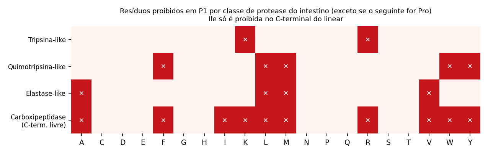
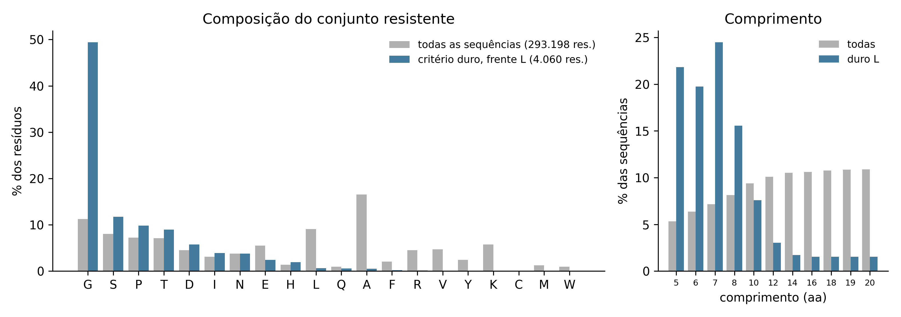
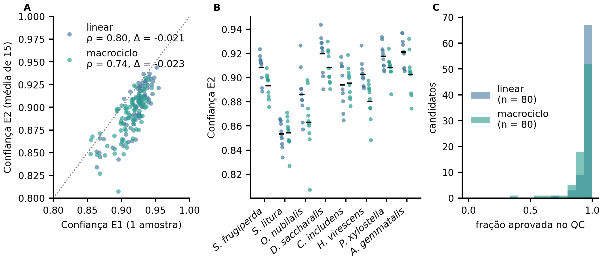
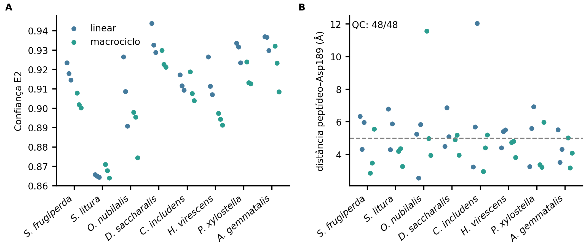
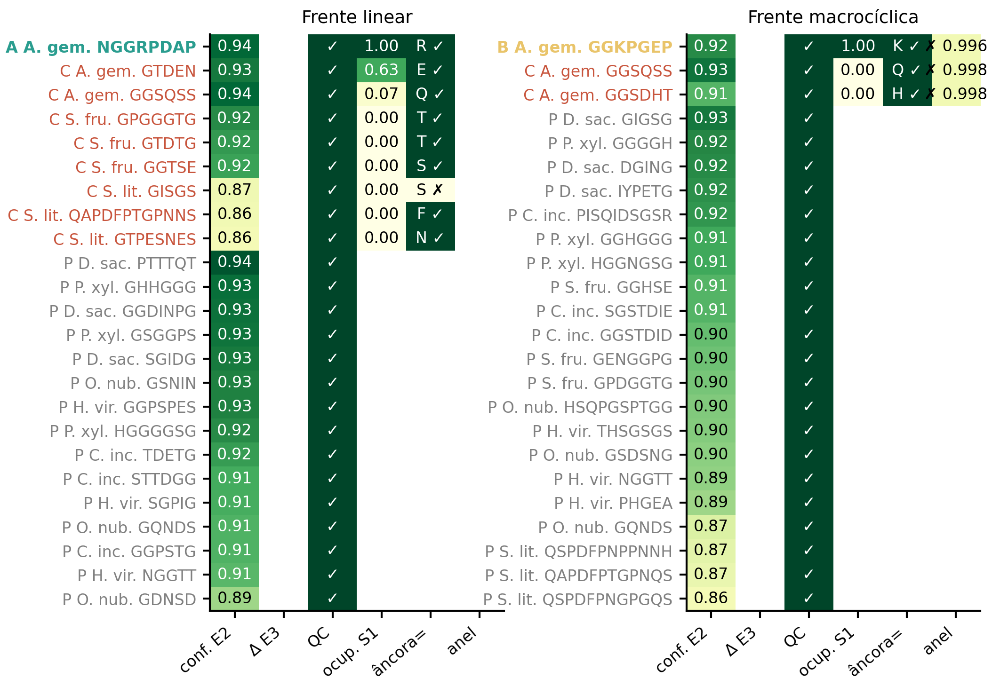
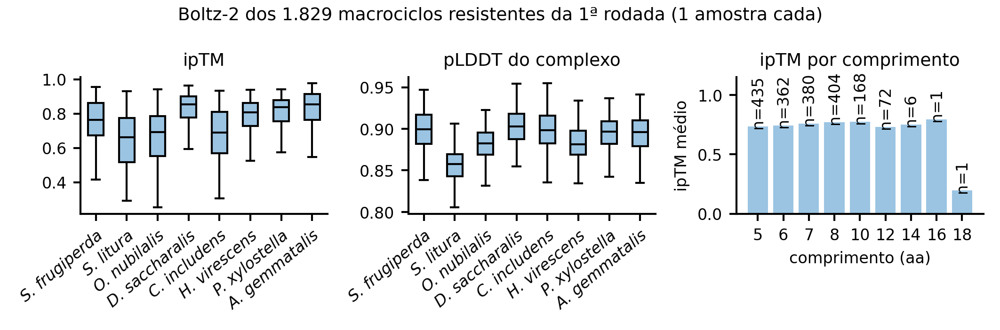

# Documento de leitura e avaliação manual

**Manuscrito:** From Natural Protease Inhibitors to De Novo Peptide Inhibitors Targeting Digestive Trypsins of Lepidopteran Pests
**Destino:** *Frontiers in Natural Products* (Frontiers) — seção *Informatics and Computational Methods*
**Versão em português para leitura interna.** O texto para submissão é o manuscrito em inglês (`manuscript/manuscript.md`); esta tradução mantém os números idênticos, com vírgula decimal e ponto de milhar, e os rótulos de classe (RESISTENTE, MARGINAL, SUSCEPTIVEL) do código. As referências permanecem em inglês, como exige a revista.

## Como ler as marcações

- Trechos em **amarelo** marcam o que ainda depende de simulações em andamento ou de informação dos autores.
- Nada nesta versão foi inventado para preencher lacunas: o que ainda depende de decisão ou de informação dos autores (lista de peptídeos recomendados, robustez ao pH) está marcado.

## Painel de conformidade com as métricas da revista

| Requisito | Limite / padrão | Situação atual | Estado |
|---|---|---|---|
| Tipo de artigo | Original Research (IMRaD: Resumo, Introdução, Material e métodos, Resultados, Discussão) | Estrutura cumprida | OK |
| Extensão do texto principal | ≤ 12.000 palavras (Original Research; página oficial de tipos de artigo da revista, conferida em 30/09/2026) | 5,837 palavras no original em inglês (corpo sem tabelas, títulos e legendas; cada citação contada como uma palavra); tradução: 6,439 | OK (margem de 6,163 palavras) |
| Resumo | ≤ 350 palavras (convenção da Frontiers; a página da revista não especifica o número) | 322 palavras no original em inglês (reescrito em 05/10/2026 para caber no limite); tradução: 370 | OK |
| Palavras-chave | 5–8 (diretrizes gerais da Frontiers) | 8 | OK |
| Título | informativo e conciso; sem limite de caracteres na página da Frontiers | título oficial definido pelos autores, 113 caracteres | OK |
| Título curto | ≤ cerca de 50 caracteres (prática da Frontiers; não especificado na página) | 43 caracteres | OK |
| Figuras | 300 dpi no tamanho final; TIFF, JPEG ou EPS; RGB | 7 figuras + 9 suplementares em PNG, TIFF (LZW) e PDF vetorial a 300 dpi, largura 180 mm, RGB; as Figuras 13 e 14 (controles) foram retiradas | OK |
| Tabelas | editáveis, com legenda | 4 tabelas | OK |
| Referências | autor-ano (Harvard), seis primeiros autores e "et al.", com DOI | 77 referências, todas com metadados conferidos no Crossref/PubMed; nenhuma citada sem estar na lista, nenhuma na lista sem ser citada | OK |
| Declaração de disponibilidade de dados | obrigatória | seção criada; falta confirmar visibilidade do repositório e DOI de arquivamento | pendente |
| Contribuições dos autores, financiamento, conflito de interesses, agradecimentos | obrigatórios | seções criadas, conteúdo a completar pelos autores | pendente |
| Declaração de uso de IA generativa | seção própria ("Generative AI statement") nos artigos de exemplo da revista | seção criada com rascunho no formato da revista, a confirmar pelos autores | pendente |
| Declaração de ética | exigida para estudos com animais ou humanos | seção criada: não se aplica | OK |
| Lista de autores e afiliações | obrigatória | não preenchida | pendente |
| Formato frente aos três artigos de exemplo da *Frontiers in Natural Products* (pasta `exemplos-papers`, 05/10/2026) | seções Conclusion, Generative AI statement e Supplementary material; resumo ≤ 350 palavras | seções criadas e resumo reescrito; Resultados e Discussão mantidos separados (os exemplos os fundem); lista de referências não reformatada (a produção da revista a reestiliza) | OK |
| Adequação ao escopo | seção *Informatics and Computational Methods* existe na revista | o título destaca inibidores naturais como moldes e padrões de calibração, mas o trabalho projeta peptídeos *de novo* e é só computacional; a revista pode exigir validação experimental | risco a verificar com o editor |

**Fonte e certeza dos limites.** Conferidos em 30/09/2026 nas páginas oficiais da Frontiers: extensão máxima de 12.000 palavras para *Original Research* na *Frontiers in Natural Products*; 5–8 palavras-chave; figuras a 300 dpi no tamanho final em TIFF, JPEG ou EPS; referências autor-ano com os seis primeiros autores; uso de IA generativa a ser reconhecido. **Não especificados nessas páginas:** limite de palavras do resumo (350 é a convenção da Frontiers, vista em outras revistas do grupo), limite de caracteres do título, número máximo de figuras/tabelas para *Original Research* e o tamanho do título curto. Confirme esses quatro pontos no sistema de submissão antes de enviar.

## Estado dos cálculos (05/10/2026, noite)

| Etapa | Estado | Resultado até aqui |
|---|---|---|
| Painel de 8 espécies e subsítios | concluído | TM-score 0,946–0,957 nos 20 pares (Seção 3.1) |
| Calibração da escada de escores | concluída | Boltz-2 10/10; RMSD do ligante 9/10; MM-GBSA 4/10; PRODIGY 2/10; os dois últimos acompanham o tamanho da interface (Seção 3.2, Figura 2) |
| Geração e critério duro | concluídos | 22.066 sequências; 527 lineares e 543 cíclicas (Seção 3.3) |
| E1–E4 · Boltz-2, reescore, controles pareados, QC de pose, matriz 8 × 8 | concluídos | 48 candidatos finais; Δ positivo em 63/78 (L) e 60/79 (M), da ordem do ruído (Seção 3.4) |
| MD de 10 ns em pH 10,0 | concluída (48/48) | a ocupância de S1 acompanha a pose inicial (Seção 3.5, Figura 5) |
| Controles em MD (7 embaralhados; 8 de troca de âncora) | simulados e retirados do artigo (05/10) | a distância inicial explica o resultado; uma frase de divulgação em 3.5 |
| PRODIGY nas 48 poses | concluído | ΔG −12,2 a −7,1 kcal/mol; acompanha o comprimento (Seção 3.6, Figura 6) |
| MD de 10 ns em pH 8,2 (48) e execuções repetidas (16) | **em curso** (`md82-*`, `md82rest-*`, `noise-*`) | fim previsto entre 06 e 07/10 (estimativa) |
| MM-GBSA e PRODIGY nas trajetórias (pH 8,2 e pH 10,0) e classificação final | **em curso** (`energy-queue`, `mmgbsa-md10`) | pendente (Seções 3.6 e 3.7) |
| Contrasseleção frente a proteases não alvo | não construída | sem ela, nenhuma seletividade é afirmada |

**Fila de cálculo:** cada MD leva cerca de 75 min com as duas frentes juntas (medido); estimativa por analogia, não medida, para o conjunto.

## Pendências antes da submissão

1. Resultados de pH 8,2, MM-GBSA e comparação com pH 10,0 (Seções 3.6 e 3.7, Figura 8); depois ajustar resumo, 4.1, 4.4 e 5.
2. Motivo do pH 8,2 (Seção 2.6) e lista de peptídeos recomendados.
3. Lista de autores, afiliações, contribuições, financiamento, conflito de interesses, declaração de IA generativa e DOI de arquivamento do código.
4. Revisar a auditoria metodológica e de código (`docs/AUDITORIA_2026-10-05.md`).

# De inibidores naturais de proteases a inibidores peptídicos *de novo* dirigidos às tripsinas digestivas de lepidópteros-praga

**Título curto:** Inibidores peptídicos *de novo* de tripsinas de pragas

**Autores:** [LISTA DE AUTORES A COMPLETAR]{custom-style="Pendente"}  
**Afiliações:** [A COMPLETAR]{custom-style="Pendente"}  
**Correspondência:** [A COMPLETAR]{custom-style="Pendente"}

**Tipo de artigo:** Original Research — seção *Informatics and Computational Methods*  
**Palavras-chave:** inibidores naturais de proteases, desenho peptídico *de novo*, tripsina digestiva, Lepidoptera, *Anticarsia gemmatalis*, resistência proteolítica, dinâmica molecular, energia livre de ligação

---

## Resumo

**Introdução:** Inibidores vegetais de proteases podem prejudicar lepidópteros-praga, mas são grandes, e peptídeos derivados de suas alças do centro reativo inibem as tripsinas digestivas apenas em concentrações submilimolares a milimolares. Não se sabe se inibidores naturais podem orientar o desenho *de novo* de peptídeos curtos que o intestino da lagarta não degrade, nem se escores de aprendizado profundo e de energia livre conseguem ordená-los. **Métodos:** Para oito lepidópteros-praga da soja, entre eles *Anticarsia gemmatalis*, subsítios catalíticos de complexos cristalográficos de inibidores naturais foram transferidos para modelos do AlphaFold, e uma escada de escores (Boltz-2, dinâmica molecular, MM-GBSA, PRODIGY) foi calibrada com seis inibidores e iscas embaralhadas. Desenhamos 22.066 sequências sobre esqueletos macrocíclicos (RFdiffusion, ProteinMPNN), mantivemos as sem resíduo P1 de proteases do intestino médio do tipo tripsina, quimotripsina ou elastase, co-dobramos com o Boltz-2 e simulamos os três melhores por espécie por 10 ns, lineares e macrocíclicos. **Resultados:** O Boltz-2 pontuou o inibidor acima de sua isca em 10 de 10 pares; o MM-GBSA o fez em 4 de 10 e o PRODIGY em 2 de 10, e ambos acompanharam o tamanho da interface (ρ = −0,93 e −0,79). O critério reteve 527 sequências lineares e 543 cíclicas, 49% glicina. Rodadas repetidas do Boltz-2 correlacionaram 0,57 (n = 442), próximo dos 0,50 entre as formas linear e cíclica da mesma sequência. Nas 48 simulações em pH 10,0 (uma execução cada), a distância mediana entre a âncora e o Asp189 subiu de 5,7 para 6,8 Å (linear) e de 5,1 para 6,1 Å (macrocíclica); quatro âncoras terminaram a menos de 4 Å, todas com partida a até 4,0 Å. A diferença pareada do Boltz-2 frente aos controles embaralhados foi positiva em 63 de 78 candidatos lineares e 60 de 79 macrocíclicos, dentro do ruído da predição. **Conclusões:** Os inibidores naturais serviram como moldes e padrões de calibração, mas a confiança do Boltz-2 sustenta apenas comparações pareadas, o MM-GBSA e o PRODIGY ordenam candidatos pelo tamanho da interface, e a ocupância de S1 em 10 ns acompanha a pose inicial. Exigir não clivabilidade seleciona peptídeos curtos e ricos em glicina, o que explicita o compromisso entre resistência e engajamento de S1. Todos os resultados são computacionais; seletividade e atividade não foram testadas.

---

## 1 Introdução

Lagartas de lepidópteros limitam a produtividade da soja na América do Sul, e a lagarta-da-soja *Anticarsia gemmatalis* é uma das desfolhadoras (Carpane et al., 2022; de Almeida Barros et al., 2021). A digestão proteica ocorre em um intestino médio fortemente alcalino, o maior pH luminal conhecido em um sistema biológico (Dow, 1992); a digestão em insetos é revisada em Terra e Ferreira, 1994. Serinoproteases do tipo tripsina são as principais enzimas digestivas das larvas de *A. gemmatalis* (de Almeida Barros et al., 2021; da Silva Júnior et al., 2020), expressas em múltiplas isoformas (Silva-Júnior et al., 2021).

Inibidores vegetais de proteases são examinados como bases para o controle de pragas: o inibidor de sementes ApTI é um inibidor de ligação forte das tripsinas de *A. gemmatalis* (Meriño-Cabrera et al., 2020), e o BPTI e o inibidor de Kunitz da soja reduziram a sobrevivência das larvas (de Almeida Barros et al., 2022). As larvas se adaptam, porém, induzindo proteases insensíveis, regulando várias enzimas digestivas e, em algumas espécies, expandindo famílias gênicas (Jongsma et al., 1995; Jongsma e Bolter, 1997; Kuwar et al., 2015; Lomate et al., 2018; Souza et al., 2016). Peptídeos curtos que imitam a alça do centro reativo são mais baratos de produzir que proteínas: peptídeos lineares da interface de um inibidor de Kunitz com a tripsina inibiram tripsinas de *S. cosmioides* (Meriño-Cabrera et al., 2020), tripeptídeos inibiram proteases de *Helicoverpa armigera* com maior eficácia em pH alcalino do intestino (Saikhedkar et al., 2018), e peptídeos bicíclicos das mesmas alças foram dez vezes mais potentes que os lineares (Saikhedkar et al., 2019). Em *A. gemmatalis*, os tripeptídeos GORE1 e GORE2 são inibidores competitivos reversíveis (K~i~ de 0,49 e 0,10 mM) que prejudicam a sobrevivência larval (de Almeida Barros et al., 2021) (seus complexos foram examinados por dinâmica molecular (de Almeida Barros et al., 2022)), peptídeos inspirados nas alças do BPTI e do inibidor de Kunitz da soja inibem proteases tipo tripsina de *A. gemmatalis* (Paulo et al., 2026), e um peptídeo guiado por estrutura contra tripsinas de *Spodoptera frugiperda* foi proposto (Severiche-Castro et al., 2026). A potência milimolar deixa espaço para desenhos com maior afinidade e estabilidade (de Almeida Barros et al., 2021; Schultz et al., 2026).

Inibidores canônicos inserem o resíduo P1 de uma alça exposta no bolso S1 (Laskowski e Kato, 1980; Laskowski e Qasim, 2000). Nas enzimas tipo tripsina, S1 é definido pelo Asp189 e favorece lisina e arginina (Perona e Craik, 1995; Hedstrom, 2002; Patarroyo-Vargas et al., 2017), que são também os sítios de clivagem da própria enzima-alvo. Um peptídeo clivado no intestino não chega ao alvo, de modo que a estabilidade proteolítica é um requisito: o intestino médio tem também endopeptidases tipo quimotripsina e tipo elastase e exopeptidases (Valaitis, 1995; Valaitis et al., 1999; Yang et al., 2012; Zhan et al., 2010; Nakonieczny et al., 2007). Uma sequência sem os resíduos P1 dessas enzimas e, como macrociclo cabeça-cauda, sem extremidades livres, deveria, em princípio, resistir a elas.

Ferramentas de aprendizado profundo geram hoje esqueletos e sequências peptídicas *de novo* (Watson et al., 2023; Dauparas et al., 2022; Rettie et al., 2025) e co-dobram complexos (Wohlwend et al., 2024; Passaro et al., 2025), mas a confiança de um modelo de co-dobramento não é uma afinidade (Wan et al., 2026), ordena poses só moderadamente (Li et al., 2026), e escores de energia livre de ponto final dependem da amostragem e do tipo de sistema (Hou et al., 2011; Genheden e Ryde, 2015; Xu et al., 2025). Uma campanha de desenho contra proteases de insetos precisa, portanto, de uma calibração explícita de cada escore que usa.

Perguntamos aqui até onde os inibidores naturais podem ser levados a inibidores peptídicos *de novo* das tripsinas digestivas de lepidópteros. Os inibidores naturais fornecem os moldes estruturais, os padrões de calibração e a lógica P1–S1; ao desenho *de novo* se pede o que lhes falta, o tamanho pequeno e a ausência de motivos de clivagem. Nós (i) definimos os subsítios catalíticos de oito tripsinas de pragas por transferência estrutural, (ii) calibramos uma escada de escores (Boltz-2, dinâmica molecular, MM-GBSA, PRODIGY) contra seis inibidores naturais e iscas embaralhadas, (iii) geramos esqueletos macrocíclicos cabeça-cauda com RFdiffusion e ProteinMPNN, (iv) aplicamos um critério duro de não clivabilidade, (v) co-dobramos os sobreviventes e os simulamos como peptídeos lineares e como macrociclos, e (vi) os ordenamos por etapa com um filtro de energia livre (Figura 1). O trabalho é inteiramente computacional: não inclui ensaio nem teste de seletividade contra proteases não alvo.

![**Figura 1.** Visão geral do pipeline. Verde: concluído; amarelo: em andamento; cinza: pendente. Oito receptores com subsítios transferidos e uma escada de escores calibrada precedem a geração de 22.066 sequências; o critério duro de não clivabilidade as divide na frente L (linear, 527) e na frente M (macrociclo, 543); o co-dobramento com o Boltz-2, o reescore, os controles pareados e o controle de qualidade de pose (E1–E4) dão 48 candidatos finais, simulados por 10 ns em pH 10,0 e 8,2 (e repetidos em 16 execuções), seguidos do filtro de energia e da classificação por etapa. Nenhum ensaio enzimático nem contrasseleção contra proteases não alvo foi feito.](figures/final/Figure1_pipeline.png){width=16.5cm}

---

## 2 Material e métodos

### 2.1 Receptores e subsítios catalíticos

Proteases digestivas do tipo tripsina de oito espécies-praga (*S. frugiperda*, *S. litura*, *Ostrinia nubilalis*, *Diatraea saccharalis*, *Chrysodeixis includens*, *Heliothis virescens*, *Plutella xylostella*, *A. gemmatalis*) e das referências *Manduca sexta* e *Bombyx mori* foram modeladas com estruturas do AlphaFold v2 (Jumper et al., 2021; Varadi et al., 2024) (Tabela 1). Só as entradas de *M. sexta* são revisadas e têm evidência de expressão no intestino médio; para as demais espécies as entradas foram escolhidas por homologia. A identidade com a tripsina B de *M. sexta* (P35046) usou um alinhamento global BLOSUM62 (Cock et al., 2009). O resíduo de especificidade foi localizado seis resíduos antes da serina catalítica (motivo G[DN]SGG[PT]), um deslocamento calibrado com a tripsina bovina e o quimotripsinogênio A (UniProt Consortium, 2025).

Os subsítios S4–S3′ (Schechter e Berger, 1967) foram definidos a partir de dois complexos cristalográficos da tripsina bovina (Berman et al., 2000), 2PTC (BPTI) e 1SFI (SFTI-1; Luckett et al., 1999). O P1 foi o resíduo do inibidor cujo carbono carbonílico fica mais perto do Oγ da serina catalítica, e um resíduo da tripsina foi atribuído a um subsítio quando qualquer um de seus átomos estava a até 4,5 Å do resíduo correspondente do inibidor. Cada cadeia de tripsina foi alinhada a cada receptor com o Foldseek em modo TM-align (van Kempen et al., 2024; Zhang e Skolnick, 2005), os resíduos foram transferidos pelo alinhamento e um par receptor–molde foi aceito com TM-score de pelo menos 0,5 e RMSD de no máximo 3,0 Å.

### 2.2 Calibração da escada de escores

Seis inibidores naturais serviram de controles positivos: BPTI (1BPI; Parkin et al., 1996), SFTI-1 (1SFI, linear), inibidor de Kunitz da soja (SKTI, 1AVU; Song e Suh, 1998), inibidor de Bowman–Birk (BBI, 1BBI; Werner e Wemmer, 1992), o inibidor de *Enterolobium contortisiliquum* (EcTI, 4J2K; Zhou et al., 2013) e ApTI (UniProt; sem estrutura). Para cada um, exceto o ApTI, gerou-se uma isca embaralhada de mesma composição. Cada ligante foi modelado com a β-tripsina bovina e com o modelo de *S. frugiperda* A0A089QDB3 (22 sistemas). Quatro escores foram comparados: (i) confiança do Boltz-2 (Passaro et al., 2025) (MSA do ColabFold (Mirdita et al., 2022); uma amostra); (ii) RMSD do esqueleto do ligante após superposição no receptor em uma simulação de 2 ns (Seção 2.6; último terço; pH 8,0 para a tripsina bovina e 10,0 para o modelo de *S. frugiperda*); (iii) MM-GBSA com o gmx_MMPBSA (Valdés-Tresanco et al., 2021) (igb = 5, sal 0,150 M, 45 quadros do último terço, sem termo de entropia); (iv) PRODIGY (Vangone e Bonvin, 2015) em quatro quadros do último terço. Um escore separou um par quando o inibidor real teve o melhor valor, com a direção fixada de antemão. Os dez pares não são independentes, porque cada isca é usada com dois receptores.

### 2.3 Geração de esqueletos e desenho de sequências

Esqueletos cíclicos cabeça-cauda foram gerados com o RFdiffusion 1.1.0 (Watson et al., 2023) (`Complex_base_ckpt`, 50 passos, `noise_scale_ca` 0,2, `noise_scale_frame` 0,1, modo cíclico, receptor fixo): dez esqueletos para cada um de 11 comprimentos (5, 6, 7, 8, 10, 12, 14, 16, 18, 19, 20 resíduos) e cada um dos oito alvos (880 esqueletos). Os pontos quentes foram os resíduos de S1 e S2 transferidos do 1SFI; só os oito primeiros em número de resíduo chegaram ao RFdiffusion (equivalentes de His57, Leu99, Asp189, Ser190, Cys191, Gln192, Gly193 e Asp194). O ProteinMPNN (Dauparas et al., 2022) (`v_48_020`, T = 0,1, ruído do esqueleto 0,05, sem cisteína, 30 sequências por esqueleto) rodou com as definições de cadeia padrão, de modo que o receptor também foi redesenhado e só o peptídeo foi mantido. Sequências idênticas foram reunidas em cada espécie.

### 2.4 Triagens de clivagem

*Triagem por escore de motivos (primeira rodada).* Cada sequência foi varrida de forma circular com sete regras simplificadas de motivo P1 baseadas no PeptideCutter (Gasteiger et al., 2005) (tripsina, quimotripsina em duas especificidades, uma regra tipo elastase, Lys-C, Arg-C e uma regra tipo pepsina). Uma contagem ponderada de sítios (pesos 1,0, 0,6 e 0,3 para as prioridades 1–3 das enzimas; só sítios internos para a tripsina; dividida por 10 e limitada a 1) deu o escore. Uma sequência foi rotulada RESISTENTE sem sítio interno de tripsina e com escore abaixo de 0,3, MARGINAL com no máximo um sítio interno e escore abaixo de 0,5, e SUSCEPTIVEL nos demais casos. Os rótulos são previsões por motivo e não medem proteólise.

*Critério duro.* Uma sequência foi mantida só se nenhum resíduo fosse K ou R (tipo tripsina), F, Y, W, L ou M (tipo quimotripsina), ou A ou V (tipo elastase), a menos que o resíduo seguinte fosse prolina. No peptídeo linear o resíduo C-terminal também foi avaliado (não pode pertencer a esse conjunto nem ser isoleucina, por causa das carboxipeptidases); no macrociclo a ligação de fechamento foi avaliada como as demais. A isoleucina foi permitida no interior. A regra foi aplicada às mesmas sequências nas interpretações linear (frente L) e cíclica (frente M). Ela se apoia nas especificidades relatadas para o intestino médio (Valaitis, 1995; Valaitis et al., 1999; Yang et al., 2012; Zhan et al., 2010; Nakonieczny et al., 2007); a exceção K/R–Pro é uma aproximação, e a aminopeptidase N, que precisa de um N-terminal livre, não é excluída nos peptídeos lineares.

### 2.5 Co-dobramento, reescore e qualidade da pose

Os candidatos foram co-dobrados com o Boltz-2 2.2.1 (Passaro et al., 2025) (MSA do receptor do ColabFold (Mirdita et al., 2022); peptídeo sem MSA, `cyclic: true` nos macrociclos). Relatamos o `confidence_score` (verificado igual a 0,8·pLDDT + 0,2·ipTM), o pLDDT e o ipTM; as saídas de afinidade não foram usadas. *E1:* os 527 candidatos lineares e 543 cíclicos do critério duro, uma predição cada. *E2:* os dez melhores candidatos por espécie e frente foram re-preditos com cinco amostras de difusão, três ciclos de reciclagem, potenciais de tempo de inferência e três sementes (15 predições); o escore é a média e a melhor amostra é a estrutura inicial. *E3:* três controles embaralhados por candidato do E2 foram preditos com o mesmo protocolo, e Δ = escore do candidato − escore médio de seus controles. *E4:* controle de qualidade da pose, com limiares fixados de antemão: nenhum par de átomos pesados peptídeo–receptor a menos de 2,2 Å; |ω| ≥ 150° (Pro cis aceita); quiralidade L; His57 Nε2–Ser195 Oγ ≤ 3,8 Å; nos macrociclos, C–N de fechamento ≤ 1,5 Å e ω de fechamento ≥ 150°. O melhor candidato de cada espécie também foi co-dobrado com os sete outros receptores (matriz cruzada 8 × 8). Os três candidatos por espécie e frente com maior confiança média no E2 entre as sequências distintas (24 lineares, 24 cíclicos) seguiram para a simulação; Δ não foi usado na seleção.

### 2.6 Dinâmica molecular

Cada um dos 48 complexos foi simulado por 10 ns em pH 10,0 (a triagem, escolhido pelo intestino médio das larvas: extratos do intestino em pH 9,56–10,0 (Karumbaiah et al., 2007); (Dow, 1992)) e em pH 8,2 [PENDENTE: os autores indicarem o motivo do pH 8,2]{custom-style="Pendente"}. A protonação das cadeias laterais foi atribuída com o PROPKA 3 (Olsson et al., 2011) pelo PDB2PQR 3.6.2 (Dolinsky et al., 2007). Os sistemas foram montados com o GROMACS 2025.4 (Abraham et al., 2015), o campo de força aditivo CHARMM36 (Huang e MacKerell, 2013) (porte de fevereiro de 2026 feito com o charmm2gmx (Wacha e Lemkul, 2023)) e água TIP3P Jorgensen et al., 1983, em caixa dodecaédrica com 1,2 nm de margem e KCl 0,10 M. O peptídeo linear tem extremidades NH~3~^+^ e COO^−^ nos dois pH (em pH 8,2 cerca de três quartos dos grupos α-amino estariam neutros no equilíbrio, e em pH 10 quase todos; isso afeta só a frente linear). O macrociclo não tem extremidades: o pdb2gmx forma a ligação cabeça-cauda a partir da geometria do Boltz-2 e gera seus termos CHARMM36, e o script de montagem para se faltar a ligação de fechamento ou o termo CMAP (maior distância C–N de fechamento por trajetória de 1,415–1,462 Å nos 24 sistemas cíclicos em pH 10,0). O protocolo foi: minimização por *steepest descent*; 200 ps de NVT e 500 ps de NPT com restrições de posição nos átomos pesados da proteína (1.000 kJ mol^−1^ nm^−2^); 10 ns de produção a 300 K e 1 bar com o termostato de reescalonamento de velocidades Bussi et al., 2007 e o barostato de Parrinello–Rahman Parrinello e Rahman, 1981, eletrostática PME Essmann et al., 1995, corte de Coulomb de 1,2 nm, van der Waals com *force-switch* entre 1,0 e 1,2 nm, vínculos LINCS nas ligações com hidrogênio e passo de 2 fs. Cada sistema foi executado uma vez por pH com semente aleatória de velocidades; quatro candidatos por frente (NGGRPDAP, GQNDS, PTTTQT e GSNIN lineares; GGHSE, GGKPGEP, IYPETG e SGSTDIE cíclicos) foram executados uma segunda vez em cada pH com outra semente, para estimar a variação entre execuções.

### 2.7 Análise das trajetórias

As trajetórias foram tornadas inteiras e centradas (`gmx trjconv -pbc mol -center`), porque receptor e peptídeo são moléculas separadas que podem ser gravadas em imagens periódicas diferentes (em uma trajetória não corrigida de uma rodada anterior de 50 ns, a distância entre os centros de massa de receptor e peptídeo chegou a 94,8 Å numa caixa de 116 Å, embora estivessem em contato). As análises usaram o MDAnalysis 2.9.0 (Michaud-Agrawal et al., 2011; Gowers et al., 2016). Em cada quadro, a distância de cada resíduo do peptídeo aos oxigênios do carboxilato do equivalente do Asp189 foi a distância mínima entre átomos pesados; o resíduo de menor distância média foi a âncora, sem supor qual seria. A ocupância de S1 é a fração de quadros com distância âncora–Asp189 abaixo de 4, 5 ou 6 Å, na trajetória inteira e em cada metade. A distância âncora–Asp189 é dada para uma janela inicial (primeiros 4%, 0,4 ns) e uma janela final (últimos 20%, 2 ns), esta também para o RMSD de Cα do peptídeo após superposição no receptor (peptídeo inteiro, imagem mais próxima do aspartato de S1). Relatamos ainda as frações de quadros com qualquer átomo do peptídeo a até 4,5 Å do Oγ da Ser ou do Nε2 da His catalíticas e com qualquer contato com o receptor, e, nos macrociclos, a distância C–N e o ω de fechamento em cada quadro. Um candidato passou na triagem declarada de antemão quando a ocupância a 5 Å na segunda metade foi de pelo menos 70%, a âncora foi a mesma nas duas metades e, nos macrociclos, o anel permaneceu íntegro (C–N ≤ 1,5 Å e ω ≥ 150° em todos os quadros). Em 2 de outubro de 2026, depois de analisadas as 16 primeiras simulações, a ocupância passou de portão a descrição (Seção 3.5), uma mudança do procedimento declarado feita depois de ver dados. Com uma execução por candidato, não se faz inferência estatística.

### 2.8 Filtro de energia, classificação e comparação de pH

O PRODIGY (Vangone e Bonvin, 2015) prevê a afinidade a partir do número de contatos intermoleculares entre classes de resíduos (carregados, polares, apolares) e da composição dos resíduos fora da interface; não tem protonação explícita. O MM-GBSA usou o gmx_MMPBSA (Valdés-Tresanco et al., 2021) (motor MMPBSA.py (Miller et al., 2012); Born generalizado igb = 5 (Onufriev et al., 2004); sal 0,150 M; trajetória única; sem entropia) na segunda metade de cada trajetória (126 quadros com espaçamento de 40 ps; receptor cadeia A, peptídeo cadeia B), com erro-padrão sobre cinco blocos de quadros; o PRODIGY foi aplicado à pose inicial (protonada em pH 8,2) e a 30 quadros da segunda metade. Os dois escores crescem com o tamanho da interface, e por isso cada um é dado também por resíduo do peptídeo. Cada etapa ordena os candidatos dentro de uma frente (1 = melhor; empates recebem o posto médio): confiança do Boltz-2 no E2, Δ pareado (E3), RMSD final do peptídeo na simulação, PRODIGY na pose e, quando disponíveis, PRODIGY e MM-GBSA na trajetória. O escore agregado é o posto médio nas etapas disponíveis. A classificação cobre os candidatos que passaram no controle de qualidade de pose, tiveram Δ > 0 e, nos macrociclos, cumpriram o critério estrito do anel; a ocupância de S1 não entra (Seção 3.5). As simulações de pH 8,2 e de pH 10,0 são pareadas (mesma pose e protocolo; o N-terminal é NH~3~^+^ nos dois): diferem na protonação das cadeias laterais, nos contraíons e na semente. São comparadas pela diferença pareada de cada métrica (mediana; teste de postos sinalizados de Wilcoxon), pela correlação de postos entre pH e pela concordância de desfechos categóricos, e a diferença de pH é lida contra a diferença entre execuções do mesmo pH.

### 2.9 Programas e dados

Os cálculos rodaram em uma NVIDIA RTX 5070 Ti (16 GB) com 32 núcleos de CPU (Python 3.10/3.11; PyTorch 2.12/2.13, CUDA 12.8/13.0). O código, a configuração, a tabela de subsítios, os dados de calibração, as listas de candidatos e os escores estão no repositório do projeto (https://github.com/eulaliobqi/design-inibidores) [visibilidade do repositório e DOI de arquivamento a confirmar]{custom-style="Pendente"}. As trajetórias estão disponíveis sob pedido.

---

## 3 Resultados

### 3.1 Painel de receptores e transferência dos subsítios

As dez sequências têm o motivo catalítico G[DN]SGG[PT] e um aspartato na posição de especificidade, o resíduo encontrado na tripsina bovina e não no quimotripsinogênio A (Tabela 1). A identidade com a tripsina B de *M. sexta* variou de 44,3% (*P. xylostella*) a 71,0% (*C. includens*) entre as pragas, e o pLDDT médio de 88,9 a 92,2. O painel é, portanto, do tipo tripsina apesar da anotação automática "Chymotrypsin", mas a expressão dessas enzimas nos intestinos médios das pragas não está documentada (Seção 2.1). O P1 foi a Lys15 no BPTI e a Lys5 no SFTI-1; nos dois complexos o conjunto de contatos de S1 teve 14 resíduos da tripsina, entre eles Asp189, Ser190, Cys191, Gln192, Gly193, Asp194, His57, Ser195, Val213, Ser214, Trp215, Gly216, Gly219 e Gly226 (Tabela S1). Todos os 20 pares receptor–molde foram aceitos (TM-score 0,946–0,957; RMSD 1,18–1,41 Å), todos os resíduos dos subsítios foram transferidos (48 de 48 para o 2PTC e 49 de 49 para o 1SFI, exossítio incluído), e o equivalente do Asp189 achado pela estrutura coincidiu com o achado pela sequência nos dez receptores.

**Tabela 1.** Painel de receptores (modelos do AlphaFold). Identidade: com a P35046 de *M. sexta*. Os números da serina catalítica e do equivalente do Asp189 se referem à numeração do modelo.

| Espécie | UniProt | Comprimento | Identidade (%) | pLDDT médio | Ser (cat.) | Eq. do Asp189 | Papel |
|---|---|---|---|---|---|---|---|
| *Spodoptera frugiperda* | A0A089QDB3 | 266 | 50,4 | 89,8 | 220 | 214 | alvo |
| *Spodoptera litura* | B3F884 | 254 | 67,3 | 90,1 | 211 | 205 | alvo |
| *Ostrinia nubilalis* | Q6R561 | 256 | 66,4 | 89,7 | 213 | 207 | alvo |
| *Diatraea saccharalis* | T1QDI0 | 257 | 65,2 | 91,0 | 213 | 207 | alvo |
| *Chrysodeixis includens* | A0A9P0BRD5 | 255 | 71,0 | 90,4 | 212 | 206 | alvo |
| *Heliothis virescens* | I7D523 | 263 | 48,4 | 89,9 | 219 | 213 | alvo |
| *Plutella xylostella* | E2IGY7 | 255 | 44,3 | 90,6 | 211 | 205 | alvo |
| *Anticarsia gemmatalis* | A0A2U8NFD7 | 260 | 63,3 | 90,9 | 217 | 211 | alvo |
| *Manduca sexta* | P35045 | 256 | 96,1 | 92,2 | 213 | 207 | referência (intestino médio curado) |
| *Bombyx mori* | A0A8R2C8B0 | 255 | 67,8 | 88,9 | 212 | 206 | não usada como alvo |

### 3.2 Calibração da escada de escores

O Boltz-2 deu confiança maior ao inibidor real do que à sua isca em 10 de 10 pares (diferenças de 0,042–0,274; mediana 0,190), o mesmo valendo para o pLDDT do complexo (10/10) e para o ipTM (10/10; a menor margem foi a do SKTI com *S. frugiperda*, 0,711 contra 0,706). Os valores absolutos se sobrepuseram (inibidores reais 0,853–0,986, iscas 0,628–0,944; a isca embaralhada do SFTI-1 chegou a 0,944 com a tripsina bovina), de modo que a discriminação vale dentro de um par e não como limiar absoluto (Figura 2A, Tabela 2). O RMSD do ligante foi menor para o inibidor real em 9 de 10 pares (a exceção foi *S. frugiperda*–EcTI, 0,366 contra 0,347 nm; Figura 2B).

O MM-GBSA favoreceu o inibidor real em 4 de 10 pares e o PRODIGY em 2 de 10 (Figura 2C, D; Tabela 2). Nos 22 sistemas, o ΔG do MM-GBSA se correlacionou com o número de resíduos do receptor em contato com o ligante (ρ de Spearman = −0,93, *P* = 7 × 10^−10^; *post hoc*) e não com o comprimento do ligante (ρ = −0,27, *P* = 0,23), e o ΔG do PRODIGY se correlacionou com seu número de contatos intermoleculares (ρ = −0,79, n = 22); a isca teve mais contatos que seu inibidor em 7 dos 10 pares (em um deles por 0,25 contato) (Figura 2E, F). Neste contexto os dois escores se comportam, portanto, como medidas do tamanho da interface e são usados adiante para ordenar candidatos contra o mesmo receptor, não como afinidades. Em um sistema (*S. frugiperda*–BPTI) o ligante estava em outra imagem periódica em pelo menos um quadro da trajetória usada no MM-GBSA, mais um motivo para não ler valores absolutos.

**Tabela 2.** Pares de calibração (inibidor real / isca embaralhada). Conf.: confiança do Boltz-2. RMSD: RMSD do ligante após superposição no receptor (nm, último terço de 2 ns). Contato: número médio de resíduos do receptor a até 4,5 Å do ligante. ΔG: MM-GBSA e PRODIGY (kcal mol^−1^). Negrito marca um par em que a isca teve escore melhor que o inibidor real.

| Receptor | Inibidor | Conf. | RMSD (nm) | Contato | ΔG MM-GBSA | ΔG PRODIGY |
|---|---|---|---|---|---|---|
| bovina | SFTI-1 | 0,986 / 0,944 | 0,084 / 0,206 | 25,1 / 23,5 | -70,2 / -64,8 | -11,8 / -10,8 |
| bovina | BBI | 0,931 / 0,794 | 0,372 / 0,452 | **22,1 / 28,1** | **-66,1 / -68,5** | **-13,5 / -13,8** |
| bovina | BPTI | 0,962 / 0,796 | 0,380 / 0,643 | **24,4 / 25,6** | -68,8 / -52,5 | **-12,2 / -12,9** |
| bovina | EcTI | 0,934 / 0,687 | 0,181 / 0,537 | **31,3 / 31,4** | **-72,7 / -79,0** | **-12,9 / -13,6** |
| bovina | SKTI | 0,954 / 0,680 | 0,275 / 0,364 | **29,6 / 36,3** | **-77,4 / -103,0** | **-13,2 / -14,8** |
| *S. frugiperda* | SFTI-1 | 0,933 / 0,869 | 0,129 / 0,274 | 35,8 / 31,0 | -86,0 / -84,0 | -10,8 / -10,1 |
| *S. frugiperda* | BBI | 0,862 / 0,650 | 0,349 / 1,167 | **37,3 / 68,7** | **-88,6 / -151,2** | **-15,2 / -20,9** |
| *S. frugiperda* | BPTI | 0,877 / 0,755 | 0,317 / 0,342 | **40,7 / 52,2** | **-112,7 / -131,6** | **-14,1 / -16,1** |
| *S. frugiperda* | EcTI | 0,868 / 0,637 | **0,366 / 0,347** | **38,0 / 66,9** | **-78,9 / -223,7** | **-11,6 / -22,2** |
| *S. frugiperda* | SKTI | 0,853 / 0,628 | 0,200 / 0,466 | **50,7 / 54,4** | -129,2 / -128,6 | **-16,4 / -18,1** |

![**Figura 2.** Calibração da escada de escores com seis inibidores naturais e iscas embaralhadas (22 sistemas; Bt: tripsina bovina, Sf: *S. frugiperda*). (A–D) Inibidor real (cheio) e isca embaralhada (vazado) para (A) confiança do Boltz-2, (B) RMSD do esqueleto do ligante após superposição no receptor (2 ns, último terço), (C) ΔG do MM-GBSA e (D) ΔG do PRODIGY; o conector é vermelho quando a isca teve escore melhor, e o número de pares (de 10) em que o inibidor teve escore melhor é dado em cada painel. (E) ΔG do MM-GBSA contra o número de resíduos do receptor a até 4,5 Å do ligante (círculos: tripsina bovina; quadrados: *S. frugiperda*; cheios: inibidor; vazados: isca). (F) ΔG do PRODIGY contra seu número de contatos intermoleculares. ρ: correlação de Spearman (*post hoc*).](figures/final/Figure2_calibration.png){width=16.5cm}

### 3.3 Geração e o critério duro de não clivabilidade

A geração produziu 880 esqueletos (110 por espécie) com o comprimento pedido e distância de fechamento N–C de 0,76–1,40 Å (sem relaxamento em nível atômico), e o ProteinMPNN rendeu 22.066 sequências únicas (2.692–2.839 por espécie; Tabela 3). A triagem por escore de motivos manteve 1.829 (8,3%) como RESISTENTE, 4.987 (22,6%) como MARGINAL e 15.250 (69,1%) como SUSCEPTIVEL; ela removeu sobretudo sequências longas (comprimento médio de 7,05 resíduos e 95,6% com 10 resíduos ou menos no conjunto RESISTENTE, contra 15,74 e 12,7% no SUSCEPTIVEL), e só 4,3% das sequências RESISTENTE continham lisina ou arginina (Figura S2). As 1.829 sequências RESISTENTE foram co-dobradas com o Boltz-2 em uma primeira rodada (confiança média 0,862, faixa 0,695–0,953; Figura S8), valores que se sobrepõem aos dos inibidores naturais e das iscas da calibração.

**Tabela 3.** Resumo da campanha por alvo.

| Espécie | Esqueletos | Sequências únicas | RESISTENTE | MARGINAL | SUSCEPTIVEL |
|---|---|---|---|---|---|
| *S. frugiperda* | 110 | 2,731 | 147 | 621 | 1,963 |
| *S. litura* | 110 | 2,706 | 205 | 607 | 1,894 |
| *O. nubilalis* | 110 | 2,739 | 238 | 667 | 1,834 |
| *D. saccharalis* | 110 | 2,807 | 247 | 638 | 1,922 |
| *C. includens* | 110 | 2,778 | 235 | 640 | 1,903 |
| *H. virescens* | 110 | 2,774 | 189 | 614 | 1,971 |
| *P. xylostella* | 110 | 2,692 | 287 | 539 | 1,866 |
| *A. gemmatalis* | 110 | 2,839 | 281 | 661 | 1,897 |
| Total | 880 | 22,066 | 1,829 | 4,987 | 15,250 |

O critério duro (Figura S1) deixou 527 sequências (2,4%) para o peptídeo linear e 543 (2,5%) para o macrociclo, 41–86 e 41–87 por espécie (Figura 3). As 527 lineares estão no conjunto cíclico; das 16 só cíclicas, 14 terminam em um resíduo proibido seguido, pelo fechamento, de uma prolina que também é o primeiro resíduo, e duas terminam em isoleucina. O conjunto duro e o conjunto do escore de motivos não se aninham (396 dos 543 candidatos cíclicos, 73%, também eram RESISTENTE). O conjunto duro é curto e rico em glicina (Figura S3): comprimento médio de 7,7 resíduos, 430 das 527 sequências lineares (81,6%) com 8 resíduos ou menos, e glicina em 49,4% dos 4.060 resíduos, seguida de serina (11,7%), prolina (9,8%), treonina (9,0%) e aspartato (5,8%). Lisina ou arginina somaram nove resíduos (0,22%), cada um seguido de prolina (seis Arg–Pro, três Lys–Pro). Proibir também a isoleucina no interior deixa 393 sequências lineares.

{width=16.5cm}

### 3.4 Co-dobramento com o Boltz-2: reprodutibilidade, controles pareados e qualidade da pose

Os 527 candidatos lineares e 543 cíclicos foram todos preditos (E1; confiança média de 0,874 e 0,862). Prever 442 candidatos cíclicos uma segunda vez com entrada idêntica deu correlação de postos de apenas 0,57 entre execuções (diferença absoluta média 0,028; 0,21–0,69 por espécie), e as predições linear e cíclica da mesma sequência (n = 527) se correlacionaram em 0,50 (Figura 4). A concordância entre as duas modalidades é, portanto, próxima da concordância entre duas execuções da mesma modalidade, e uma única predição não separa um efeito da modalidade do ruído de amostragem. No E2, os dez melhores candidatos por espécie e frente foram re-preditos (15 predições cada): a confiança média caiu de 0,922 para 0,900 (linear) e de 0,911 para 0,888 (cíclico), a regressão esperada para um conjunto de topo; o desvio-padrão entre as 15 predições de um candidato foi em média de 0,019 e 0,022, da ordem da dispersão entre os dez candidatos de uma espécie, de modo que a ordem dentro de um top dez não é resolvida (Figura S4). Todo candidato teve ao menos uma amostra que passou no controle de qualidade de pose, e os 48 candidatos selecionados passaram, com a tríade catalítica íntegra (distância His57–Ser195 de 2,4–3,4 Å) e nenhum par de átomos pesados peptídeo–receptor a menos de 2,4 Å (Figura S5). A distância mínima ao carboxilato do Asp189 na estrutura inicial foi de 5 Å ou menos em 9 das 24 estruturas lineares e 18 das 24 cíclicas. Só três dos 48 contêm lisina ou arginina (o linear NGGRPDAP; os cíclicos PISQIDSGSR e GGKPGEP).

A diferença pareada Δ frente a três controles embaralhados (E3) foi positiva em 63 dos 78 candidatos lineares (81%; mediana 0,013, intervalo interquartil 0,003–0,030) e em 60 dos 79 cíclicos (76%; mediana 0,014); entre os 48 candidatos finais foi positiva em 23 de 24 lineares e 22 de 24 cíclicos. As diferenças são da ordem do desvio-padrão entre as 15 predições de um candidato (0,02), cada Δ se apoia em três controles, e os controles embaralhados de sequências ricas em glicina se parecem com o candidato (identidade média de 0,35 linear, 0,29 cíclico); um Δ positivo significa, portanto, que o candidato não pontuou abaixo de seus controles, e não que se liga. A matriz cruzada (melhor candidato de cada espécie contra seu receptor e os outros sete) não mostrou preferência espécie-específica: o receptor próprio deu a maior confiança em 4 de 8 (linear) e 3 de 8 (cíclico) espécies, e o receptor explicou mais variação que o peptídeo (o modelo de *S. litura* deu a menor confiança média nas duas frentes). Como a confiança do Boltz-2 não é afinidade (Seção 3.2), isso não demonstra nem refuta seletividade.

{width=16.5cm}

### 3.5 Simulações de 10 ns em pH 10,0

As 48 simulações (uma execução cada) terminaram e foram analisadas com o procedimento da Seção 2.7 (Figura 5). A distância mediana âncora–Asp189 subiu de 5,72 Å na janela inicial para 6,77 Å na janela final nos candidatos lineares, e de 5,07 para 6,11 Å nos cíclicos. Na janela final a âncora estava a até 4 Å do Asp189 em 2 de 24 simulações lineares e 2 de 24 cíclicas, e a mais de 10 Å em 6 e 4. A ocupância na segunda metade a 5 Å chegou a pelo menos 0,70 em 5 das 48: NGGRPDAP (âncora Arg, 1,00) e GQNDS (Gln, 1,00) na frente linear, e GGKPGEP (Lys, 1,00), GGHSE (His, 0,99) e GGGGH (His, 0,82) na frente cíclica. A âncora foi a mesma nas duas metades em 21 de 24 simulações lineares e 24 de 24 cíclicas. O peptídeo manteve algum contato com o receptor a até 4,5 Å em pelo menos 0,82 (linear) e 0,97 (cíclico) dos quadros, de modo que sair de S1 não significou dissociação; o contato com a serina e a histidina catalíticas esteve presente com a âncora longe de S1 e não discrimina. O RMSD final do peptídeo teve mediana de 0,56 nm (0,21–2,64) na frente linear e de 0,30 nm (0,16–1,69) na cíclica. Nas 24 simulações cíclicas o anel permaneceu fechado (C–N no máximo 1,462 Å); 11 cumpriram o critério estrito e os outros 13 ficaram abaixo do limite de ω (mínimo de 137,2–149,9°) em pelo menos um quadro, em 12 deles em menos de 2,2% dos quadros (Figura S6).

*A pose inicial decide o resultado.* Uma ocupância de pelo menos 0,70 na segunda metade ocorreu em 5 das 9 simulações cujo peptídeo partiu a até 4,0 Å do carboxilato do Asp189 e em nenhuma das 39 que partiram mais longe (teste exato de Fisher, *P* = 7 × 10^−5; descritivo, porque cada candidato foi executado uma vez e a âncora é definida *post hoc*). As distâncias inicial e final se correlacionaram (ρ de Spearman = 0,63) e a distância inicial se relacionou inversamente com a ocupância (ρ = −0,63); a identidade da âncora não separou as cinco (Arg, Gln, Lys e duas His; três delas sem resíduo básico). A triagem de 10 ns re-relata, portanto, a pose proposta pelo Boltz-2: mede se uma pose já em S1 sobrevive, e um peptídeo colocado a 5 Å não recebe tempo para achar o bolso. Por isso a ocupância passou de critério a descrição (Seção 2.7).

*Escala de referência.* A análise idêntica dos complexos de calibração (receptor de *S. frugiperda*; 2 ns; outro campo de força e pH) deu ocupância de 1,00 na segunda metade para as cinco iscas embaralhadas e para quatro dos seis inibidores; nos onze sistemas a âncora era uma lisina ou uma arginina, que chegam a S1 sempre que são colocadas ali (Brandsdal et al., 2006; Helland et al., 1999). A ocupância mede, portanto, a colocação, e não a discriminação entre ligante e isca. Também foram simulados, no mesmo protocolo, controles embaralhados dos candidatos (sete) e variantes com a âncora trocada por Asp ou Leu (oito); eles não são usados, porque a distância inicial ao Asp189 explicou o desfecho (os controles que partiram a até 2,74 Å chegaram todos a 1,00; as variantes partiram de 1,0 a 4,8 Å mais longe que seus originais), de modo que não separam sequência de pose. Pela regra fixada antes das rodadas, um controle que não separa é retirado das análises e das camadas; as análises estão no repositório.

![**Figura 5.** Simulações de triagem de 10 ns em pH 10,0 (CHARMM36, 300 K, uma execução cada; as 48 terminaram). (A) Distância do resíduo âncora ao carboxilato do Asp189 e (B) RMSD local do peptídeo (Cα, alinhado ao receptor) para os três candidatos de *A. gemmatalis* de cada frente (contínuo, tracejado e pontilhado: candidatos 1, 2 e 3). (C) Ocupância de S1 a 5 Å na primeira e na segunda metades das 48 simulações (círculo: passa na triagem como declarada originalmente; cruz: não passa; a linha tracejada é o nível de 70%, agora descritivo). (D) Por simulação, linear (em cima) e macrocíclica (embaixo): ocupância na segunda metade, contato com a serina catalítica e qualquer contato com o receptor; ✗ marca macrociclos que falharam no critério estrito do anel e ✓ os que o cumpriram.](figures/pt/fig11_md_triagem_10ns.png){width=16.5cm}

### 3.6 Filtro de energia e classificação por etapa

O PRODIGY nas poses iniciais dos 48 candidatos (protonadas em pH 8,2) deu ΔG entre −12,2 e −7,1 kcal mol^−1^ (mediana −9,6) e acompanhou o tamanho do peptídeo (ρ de Spearman com o número de resíduos −0,60; com o número de contatos −0,62; Figura 6A). Os menores valores são dos macrociclos mais longos (QSPDFPNPPNNH −12,2 e QAPDFPTGPNQS −12,1, ambos de *S. litura*), e o NGGRPDAP tem o menor valor da frente linear (−11,1); GQNDS, GGHSE e GGKPGEP têm −9,0, −8,8 e −9,7 (por resíduo: −1,80, −1,76 e −1,39 contra −1,39 do NGGRPDAP). Dada a calibração (Seção 3.2), esses valores ordenam candidatos de tamanho parecido e não são afinidades.

A classificação por etapa entre os 33 candidatos que passaram nos portões (23 lineares, 10 cíclicos) com as etapas disponíveis (confiança do Boltz-2 no E2, Δ, RMSD final da simulação de pH 10,0, PRODIGY na pose) colocou PTTTQT (posto médio 4,6), NGGRPDAP (6,5), SGPIG (7,6), GSNIN (8,5) e GTDEN (9,1) à frente na frente linear, e IYPETG (3,2), SGSTDIE (3,5), NGGTT (4,3), GGSTDID (4,6) e GGHSE (5,0) à frente na cíclica (Figura 6B). Os postos de um mesmo candidato variam muito entre as etapas (por exemplo, o NGGRPDAP é o 2º pelo E2 e o 13º pelo Δ), de modo que a classificação agregada é uma triagem grosseira e não uma medida.

[PENDENTE: MM-GBSA e PRODIGY nas trajetórias de pH 8,2 e a classificação com todas as etapas (arquivos `outputs/ranking_energy_final_all.*`; fila `energy-queue`).]{custom-style="Pendente"}

![**Figura 6.** Filtro de energia e classificação por etapa. (A) ΔG do PRODIGY da pose inicial dos 48 candidatos contra o comprimento do peptídeo (ρ: Spearman). (B) Posto de cada candidato dentro de sua frente em cada etapa (1 = melhor) e o agregado (posto médio) para os dez melhores candidatos de cada frente entre os que passaram nos portões; etapas mostradas: confiança do Boltz-2 no E2, Δ pareado (E3), RMSD final da simulação de pH 10,0 e PRODIGY na pose. O MM-GBSA e as etapas de pH 8,2 estão pendentes.](figures/final/Figure6_energy_ranking.png){width=16.5cm}

### 3.7 pH 8,2 versus pH 10,0

[PENDENTE: comparação pareada das 48 simulações de pH 8,2 e pH 10,0 (distância âncora–Asp189, ocupância, RMSD, contatos, anel, MM-GBSA, PRODIGY), os estados de protonação que diferem, a variação entre execuções dos candidatos repetidos e a concordância das classificações (`scripts/compare_ph.py`; Figura 8).]{custom-style="Pendente"}

### 3.8 Peptídeos candidatos

Quatro peptídeos se destacam pelos critérios declarados de antemão e pelas etapas acima (Tabela 4, Figura 7). O GGHSE (*S. frugiperda*, cíclico) é a única simulação que combinou ocupância de pelo menos 0,70 com o critério estrito do anel. O GQNDS (*O. nubilalis*, linear) chegou a ocupância de 1,00 com âncora Gln. O NGGRPDAP (*A. gemmatalis*, linear) tem uma Arg em S1 seguida de prolina, o mecanismo canônico, e o menor ΔG do PRODIGY da frente linear. O GGKPGEP (*A. gemmatalis*, cíclico) tem a menor distância final âncora–Asp189 (2,71 Å) e uma Lys seguida de prolina, mas fica abaixo do limite de ω do critério estrito do anel (mínimo de 144,5° contra 150°). Os quatro partiram com a âncora a até 4,0 Å do Asp189 (Seção 3.5), e nem a pose inicial do Boltz-2 nem a simulação de 10 ns os separa de uma sequência embaralhada; são candidatos que sobreviveram aos filtros disponíveis, e nenhum carrega alegação de seletividade ou atividade. Os 48 candidatos também foram classificados em camadas A–C pelos critérios declarados antes das simulações (23 A e 1 B lineares; 10 A, 13 B e 1 C cíclicos; Figura S7); a camada A exclui poucos candidatos e não discrimina entre os demais.

**Tabela 4.** Candidatos da lista curta. Inicial e final: distância âncora–Asp189 nas janelas inicial e final da simulação de 10 ns em pH 10,0. Ocup.: ocupância a 5 Å na segunda metade (descritiva). ΔG PRODIGY: pose inicial; entre parênteses, por resíduo. MM-GBSA em pH 8,2 pendente.

| Peptídeo | Frente | Espécie | Comprimento | Conf. E2 | Δ (E3) | Âncora | Inicial (Å) | Final (Å) | Ocup. | Anel | ΔG PRODIGY (kcal mol^−1^) |
|---|---|---|---|---|---|---|---|---|---|---|---|
| NGGRPDAP | linear | *A. gemmatalis* | 8 | 0,937 | 0,030 | Arg | 2,78 | 2,74 | 1,00 | – | −11,1 (−1,39) |
| GQNDS | linear | *O. nubilalis* | 5 | 0,909 | 0,013 | Gln | 4,00 | 3,77 | 1,00 | – | −9,0 (−1,80) |
| GGHSE | cíclico | *S. frugiperda* | 5 | 0,908 | 0,015 | His | 2,86 | 3,07 | 0,99 | estrito | −8,8 (−1,76) |
| GGKPGEP | cíclico | *A. gemmatalis* | 7 | 0,923 | 0,020 | Lys | 2,71 | 2,71 | 1,00 | não estrito | −9,7 (−1,39) |

{width=16.5cm}

---

## 4 Discussão

### 4.1 Principais achados

Montamos e calibramos um pipeline que vai de oito tripsinas digestivas de lepidópteros a peptídeos candidatos ordenados, com a não clivabilidade pelas proteases do intestino médio como requisito binário explícito. A parte estrutural foi robusta: os subsítios de dois complexos cristalográficos foram transferidos para os dez receptores, e o equivalente do Asp189 achado pela estrutura coincidiu com o achado pela sequência. A escada de escores foi mais fraca: o Boltz-2 separou inibidores reais de iscas dentro dos pares, mas o MM-GBSA e o PRODIGY não separaram e acompanharam o tamanho da interface. Exigir não clivabilidade deixou 527 sequências lineares e 543 cíclicas, curtas e com quase metade de glicina. As simulações de 10 ns mostraram que a ocupância de S1 acompanha a pose inicial do Boltz-2, de modo que as simulações verificam a estabilidade de uma pose e não são evidência de ligação. Nenhum resultado diz respeito a atividade inibitória ou a seletividade.

Os inibidores naturais forneceram os subsítios (2PTC, 1SFI), os padrões de calibração e a lógica de ancoragem em S1. Não forneceram sua característica definidora: os peptídeos desenhados não têm cisteína, de modo que as alças estabilizadas por dissulfeto de BPTI, SKTI e SFTI-1 (Luckett et al., 1999; Kelly et al., 2005) não são reproduzidas, e o anel cabeça-cauda é a única restrição mantida, em uma das duas frentes. A rigidez não é simplesmente uma vantagem contra tripsinas adaptadas de lepidópteros: um inibidor de Bowman–Birk com sete ligações dissulfeto inibiu as enzimas tipo tripsina de *A. gemmatalis* menos que o inibidor de Kunitz da soja (Patarroyo-Vargas et al., 2020).

### 4.2 O que a escada de escores sustenta

O Boltz-2 preferiu o inibidor real em todos os pares, mas os escores absolutos se sobrepuseram, e uma isca embaralhada de 14 resíduos do SFTI-1 pontuou 0,944. Os candidatos têm 5–8 resíduos e foram em sua maioria pontuados entre 0,80 e 0,95, de modo que a calibração sustenta comparar um candidato com um controle pareado e não ler 0,9 como evidência de ligação. Isso concorda com uma avaliação do Boltz-2 em dois conjuntos de pequenas moléculas, que achou só correlações fracas a moderadas de suas predições de afinidade com energias livres físicas e concluiu que ele não tem a resolução energética para identificar líderes (Wan et al., 2026), e com um *benchmark* de 111 complexos peptídeo cíclico–proteína, em que a confiança do modelo se correlacionou só moderadamente com a qualidade da pose (Spearman 0,53–0,66) e cerca de 12% das poses tinham confiança alta apesar de qualidade ruim (Li et al., 2026). Usamos o escore de confiança e não a saída de afinidade do Boltz-2, de modo que o primeiro resultado é uma cautela e não um teste do nosso uso. A correlação de postos de 0,57 entre execuções com entrada idêntica acrescenta um limite: diferenças de poucos centésimos na confiança não devem ser interpretadas, e a concordância entre as formas linear e cíclica (ρ = 0,50) não pode ser lida como efeito da modalidade até ser comparada com esse teto. As iscas são sequências embaralhadas de proteínas dobradas, de modo que diferem dos inibidores no enovelamento e não só na ligação, os ligantes da calibração têm 14–176 resíduos contra 5–8 dos candidatos, e os pares não são independentes.

O MM-GBSA de uma única trajetória de 2 ns sem entropia favoreceu o inibidor real em 4 de 10 pares, e o PRODIGY, treinado em complexos proteína–proteína (Vangone e Bonvin, 2015), em 2 de 10; os dois estão próximos de medidas do número de contatos, de acordo com a sensibilidade dos métodos de ponto final à amostragem e ao tipo de sistema (Hou et al., 2011; Genheden e Ryde, 2015; Xu et al., 2025). São usados, por isso, para ordenar peptídeos do mesmo receptor e do mesmo protocolo, com um valor por resíduo, e não para estimar afinidade. Para comparação, um estudo de um peptídeo derivado de interface contra tripsinas de *S. frugiperda* usou simulações de 100 ns em triplicata e MM/GBSA (Severiche-Castro et al., 2026); nossa triagem é uma única execução de 10 ns por candidato e não consegue estabelecer estabilidade.

Um ponto metodológico merece ênfase: moléculas separadas de receptor e ligante podem ser gravadas em imagens periódicas diferentes da caixa. Em um de nossos sistemas a distância entre os centros de massa de receptor e peptídeo chegou a 94,8 Å numa caixa de 116 Å enquanto as moléculas estavam em contato em todos os quadros. Qualquer análise de RMSD ou de contatos de simulações proteína–peptídeo que não corrija isso relata o deslocamento da imagem como instabilidade.

### 4.3 Resistência à proteólise e engajamento de S1 puxam em sentidos opostos

A triagem seleciona peptídeos curtos (comprimento médio de 7,7 resíduos) e quase sem resíduos básicos. Nos inibidores canônicos o resíduo P1 se insere em S1 (Laskowski e Kato, 1980; Laskowski e Qasim, 2000), e as enzimas tipo tripsina, inclusive as de *A. gemmatalis*, preferem arginina ou lisina ali (Patarroyo-Vargas et al., 2017; Meriño-Cabrera et al., 2022); o critério duro seleciona, portanto, contra o resíduo mais adequado para engajar o Asp189. Ao proibir todo resíduo que uma enzima tipo tripsina, quimotripsina ou elastase pode assumir em P1, ele deixa peptídeos com quase metade de glicina e só nove resíduos básicos, cada um protegido por uma prolina seguinte, uma exceção tirada da especificidade geral das enzimas e aproximada para cada espécie. Tais sequências são provavelmente flexíveis, o que pode custar entropia de ligação, e lhes faltam as cadeias laterais que definem a interação de S1 dos inibidores canônicos. A alternativa canônica é a rigidez, que melhora a ligação em cerca de seis ordens de grandeza e protege contra a proteólise (Kelly et al., 2005); um macrociclo poderia tolerar um P1 básico que uma regra linear de motivos sinaliza. Os três candidatos que carregam uma Lys ou Arg (NGGRPDAP, PISQIDSGSR, GGKPGEP) são aqueles em que isso pode ser examinado, e a presente triagem não diz se sua conformação mantém esse resíduo protegido. A ciclização remove as extremidades expostas, mas não os sítios internos (o macrociclo ganhou só 16 sequências sobre o conjunto linear), e a aminopeptidase N, que precisa de um N-terminal livre, não é tratada nos peptídeos lineares. As regras de motivos são grosseiras (uma contagem ponderada de sítios; a regra tipo elastase sinaliza quatro resíduos comuns), e RESISTENTE é uma previsão de baixa carga de motivos, não uma medida de estabilidade no intestino médio.

### 4.4 Limitações

(i) Todos os resultados são computacionais; nenhum ensaio de inibição ou de estabilidade foi feito. (ii) A seletividade não foi tratada: S1 é conservado entre tripsinas, e um peptídeo ancorado ali não pode ser presumido como poupando proteases não alvo. (iii) Os receptores são modelos do AlphaFold, e a expressão no intestino médio não está documentada nas espécies-praga. (iv) O ProteinMPNN redesenhou o receptor junto com o peptídeo, só oito dos 15 resíduos de ponto quente chegaram ao RFdiffusion, e as sequências foram desenhadas sobre esqueletos cíclicos, de modo que a frente linear avalia as mesmas sequências sem redesenho. (v) O critério de não clivabilidade é uma previsão em nível de motivo; a exceção K/R–Pro é uma aproximação e a aminopeptidase N não é excluída nos peptídeos lineares. (vi) Cada simulação é uma única execução de 10 ns com um campo de força, e trajetórias únicas podem dar conclusões falso-positivas (Knapp et al., 2018); o peptídeo linear tem extremidades NH~3~^+^/COO^−^ nos dois pH; dez nanossegundos só fazem triagem. A equilibração NPT usou o barostato de Parrinello–Rahman, onde um barostato de relaxação é o padrão, e `refcoord_scaling` não foi definido com restrições de posição sob acoplamento de pressão; os dois desvios foram mantidos para que todas as simulações sigam um só protocolo (pH 10,0 e 8,2 usaram o mesmo código), e em três sistemas a densidade ficou em 1022–1033 kg m^−3^ com flutuação quadrática média de 0,2% e deriva desprezível. (vii) O critério de ocupância de S1 não tem especificidade demonstrada: toda isca da calibração o satisfez, e os controles de sequência embaralhada e de troca de âncora não separaram sequência de pose inicial (Seção 3.5); a âncora é definida *post hoc* como o resíduo de menor distância média. (viii) Uma única predição do Boltz-2 é um ordenador ruidoso (ρ = 0,57 para entrada idêntica), e os controles embaralhados do E3 são fracos para sequências ricas em glicina. (ix) Os sistemas de calibração foram simulados por 2 ns a partir de uma estrutura predita cada, com ligantes muito maiores que os candidatos. (x) O MM-GBSA e o PRODIGY não separaram inibidores de iscas, de modo que a classificação de energia é uma triagem grosseira.

### 4.5 Perspectivas

Os aperfeiçoamentos mais diretos são fixar a sequência do receptor durante o desenho e permitir exatamente um P1 básico seguido de prolina já no desenho; desenhar esqueletos lineares diretamente e proteger as extremidades dos peptídeos lineares; fazer simulações replicadas dos peptídeos da lista curta, estendidas a centenas de nanossegundos; e acrescentar uma contrasseleção contra proteases não alvo para que a seletividade vire objetivo. O teste decisivo é enzimático: ensaios de inibição com extratos do intestino médio de *A. gemmatalis* e com tripsinas não alvo, e um ensaio de estabilidade dos candidatos nos mesmos extratos.

---

## 5 Conclusão

Os inibidores naturais serviram como moldes e padrões de calibração para um pipeline que leva oito tripsinas digestivas de lepidópteros a um conjunto ordenado de peptídeos curtos e não clivaveis. O Boltz-2 sustenta comparações pareadas; o MM-GBSA e o PRODIGY ordenam candidatos pelo tamanho da interface; e a ocupância de S1 em 10 ns acompanha a pose inicial, de modo que, por si só, não indica ligação. Os quatro peptídeos da lista curta (NGGRPDAP, GQNDS, GGHSE, GGKPGEP) sobreviveram aos filtros disponíveis e não carregam alegação de seletividade ou atividade. Os testes decisivos são enzimáticos.

## Declaração de disponibilidade de dados

O código, os arquivos de configuração, as listas de candidatos e os escores por candidato estão no repositório do projeto (https://github.com/eulaliobqi/design-inibidores). [PENDENTE: confirmar a visibilidade do repositório e o DOI de arquivamento (por exemplo, Zenodo) antes da submissão.]{custom-style="Pendente"}

## Declaração de ética

Não se aplica. É um estudo computacional; não envolveu animais, participantes humanos nem dados pessoais.

## Contribuições dos autores

[PENDENTE: a completar pelos autores (papéis CRediT).]{custom-style="Pendente"}

## Financiamento

[PENDENTE: a completar pelos autores.]{custom-style="Pendente"}

## Agradecimentos

[PENDENTE: a completar pelos autores.]{custom-style="Pendente"}

## Conflito de interesses

[PENDENTE: a completar pelos autores. Texto padrão da Frontiers usado em dois dos três artigos de exemplo: "The author(s) declared that this work was conducted in the absence of any commercial or financial relationships that could be construed as a potential conflict of interest."]{custom-style="Pendente"}

## Declaração de IA generativa

[PENDENTE, autores a confirmar o texto, no formato usado pela Frontiers in Natural Products: "The author(s) declared that generative AI was used in the creation of this manuscript. During the preparation of this manuscript, the authors used Claude (Anthropic) to write analysis scripts, generate figures, and draft and translate text. The authors verified all numerical results against the output files, verified every reference against Crossref or PubMed, and take full responsibility for the content."]{custom-style="Pendente"}

## Material suplementar

As Figuras S1–S9 e a Tabela S1 (legendas e tabela abaixo) são fornecidas como material suplementar.

## Figuras suplementares

{width=13cm}

{width=13cm}

{width=13cm}

{width=13cm}

{width=13cm}

{width=13cm}

{width=13cm}

{width=13cm}

![**Figura S9.** Triagem por escore de motivos por espécie sob a regra linear-estrita e a circular.

**Tabela S1.** Subsítios de referência (resíduos da tripsina bovina a até 4,5 Å do resíduo do inibidor em cada posição).

| Subsítio | Resíduo do BPTI | Contatos da tripsina (2PTC) | Resíduo do SFTI-1 | Contatos da tripsina (1SFI) |
|---|---|---|---|---|
| S4 | Gly12 | Gln192 | Arg2 | Asn97, Gln175, Gly216, Ser217, Trp215 |
| S3 | Pro13 | Gln192, Gly216, Trp215 | Cys3 | Gln192, Gly216, Trp215 |
| S2 | Cys14 | Gln192, His57, Leu99, Ser195, Ser214, Trp215 | Thr4 | Gln192, His57, Leu99, Ser195, Ser214, Trp215 |
| S1 | Lys15 | Asp189, Asp194, Cys191, Gln192, Gly193, Gly216, Gly219, Gly226, His57, Ser190, Ser195, Ser214, Trp215, Val213 | Lys5 | os mesmos 14 resíduos |
| S1′ | Ala16 | Cys42, Gln192, Gly193, His57, Phe41, Ser195 | Ser6 | os mesmos 6 resíduos |
| S2′ | Arg17 | Gln192, Gly193, His40, Phe41, Tyr151, Tyr39 | Ile7 | os mesmos 6 resíduos |
| S3′ | Ile18 | His57, Phe41, Tyr39 | Pro8 | nenhum |](figures/pt/figS1_regras_motivo.png){width=13cm}

## Referências

Abraham MJ, Murtola T, Schulz R, Páll S, Smith JC, Hess B, et al. (2015). GROMACS: High performance molecular simulations through multi-level parallelism from laptops to supercomputers. SoftwareX 1-2, 19-25. doi: 10.1016/j.softx.2015.06.001

Berman HM, Westbrook J, Feng Z, Gilliland G, Bhat TN, Weissig H, et al. (2000). The Protein Data Bank. Nucleic Acids Research 28, 235-242. doi: 10.1093/nar/28.1.235

Brandsdal BO, Smalås AO, Åqvist J (2006). Free energy calculations show that acidic P1 variants undergo large pKa shifts upon binding to trypsin. Proteins: Structure, Function, and Bioinformatics 64, 740-748. doi: 10.1002/prot.20940

Bussi G, Donadio D, Parrinello M (2007). Canonical sampling through velocity rescaling. The Journal of Chemical Physics 126, 014101. doi: 10.1063/1.2408420

Carpane PD, Llebaria M, Nascimento AF, Vivan L (2022). Feeding injury of major lepidopteran soybean pests in South America. PLOS ONE 17, e0271084. doi: 10.1371/journal.pone.0271084

Cock PJA, Antao T, Chang JT, Chapman BA, Cox CJ, Dalke A, et al. (2009). Biopython: freely available Python tools for computational molecular biology and bioinformatics. Bioinformatics 25, 1422-1423. doi: 10.1093/bioinformatics/btp163

da Silva Júnior NR, Vital CE, de Almeida Barros R, Faustino VA, Monteiro LP, Barros E, et al. (2020). Intestinal proteolytic profile changes during larval development of Anticarsia gemmatalis caterpillars. Archives of Insect Biochemistry and Physiology 103, e21631. doi: 10.1002/arch.21631

Dauparas J, Anishchenko I, Bennett N, Bai H, Ragotte RJ, Milles LF, et al. (2022). Robust deep learning–based protein sequence design using ProteinMPNN. Science 378, 49-56. doi: 10.1126/science.add2187

de Almeida Barros R, Meriño-Cabrera Y, Vital CE, da Silva Júnior NR, de Oliveira CN, Lessa Barbosa S, et al. (2021). Small peptides inhibit gut trypsin-like proteases and impair Anticarsia gemmatalis (Lepidoptera: Noctuidae) survival and development. Pest Management Science 77, 1714-1723. doi: 10.1002/ps.6191

de Almeida Barros R, Meriño-Cabrera Y, Severiche Castro JG, Rodrigues da Silva Júnior N, Schultz H, de Andrade RJ, et al. (2022). Inhibition constant and stability of tripeptide inhibitors of gut trypsin-like enzyme of the soybean pest Anticarsia gemmatalis. Archives of Insect Biochemistry and Physiology 110, e21887. doi: 10.1002/arch.21887

de Almeida Barros R, Meriño-Cabrera Y, Castro JS, da Silva Junior NR, de Oliveira JVA, Schultz H, et al. (2022). Bovine pancreatic trypsin inhibitor and soybean Kunitz trypsin inhibitor: Differential effects on proteases and larval development of the soybean pest Anticarsia gemmatalis (Lepidoptera: Noctuidae). Pesticide Biochemistry and Physiology 187, 105188. doi: 10.1016/j.pestbp.2022.105188

Dolinsky TJ, Czodrowski P, Li H, Nielsen JE, Jensen JH, Klebe G, et al. (2007). PDB2PQR: expanding and upgrading automated preparation of biomolecular structures for molecular simulations. Nucleic Acids Research 35, W522-W525. doi: 10.1093/nar/gkm276

Dow JAT (1992). pH gradients in lepidopteran midgut. Journal of Experimental Biology 172, 355-375. doi: 10.1242/jeb.172.1.355

Essmann U, Perera L, Berkowitz ML, Darden T, Lee H, Pedersen LG (1995). A smooth particle mesh Ewald method. The Journal of Chemical Physics 103, 8577-8593. doi: 10.1063/1.470117

Gasteiger E, Hoogland C, Gattiker A, Duvaud S, Wilkins MR, Appel RD, et al. (2005). Protein Identification and Analysis Tools on the ExPASy Server. The Proteomics Protocols Handbook , 571-607. doi: 10.1385/1-59259-890-0:571

Genheden S, Ryde U (2015). The MM/PBSA and MM/GBSA methods to estimate ligand-binding affinities. Expert Opinion on Drug Discovery 10, 449-461. doi: 10.1517/17460441.2015.1032936

Gowers R, Linke M, Barnoud J, Reddy T, Melo M, Seyler S, et al. (2016). MDAnalysis: A Python Package for the Rapid Analysis of Molecular Dynamics Simulations. Proceedings of the Python in Science Conference , 98-105. doi: 10.25080/majora-629e541a-00e

Hedstrom L (2002). Serine Protease Mechanism and Specificity. Chemical Reviews 102, 4501-4524. doi: 10.1021/cr000033x

Helland R, Otlewski J, Sundheim O, Dadlez M, Smalås AO (1999). The crystal structures of the complexes between bovine β-trypsin and ten P1 variants of BPTI. Journal of Molecular Biology 287, 923-942. doi: 10.1006/jmbi.1999.2654

Hou T, Wang J, Li Y, Wang W (2011). Assessing the Performance of the MM/PBSA and MM/GBSA Methods. 1. The Accuracy of Binding Free Energy Calculations Based on Molecular Dynamics Simulations. Journal of Chemical Information and Modeling 51, 69-82. doi: 10.1021/ci100275a

Huang J, MacKerell AD (2013). CHARMM36 all-atom additive protein force field: Validation based on comparison to NMR data. Journal of Computational Chemistry 34, 2135-2145. doi: 10.1002/jcc.23354

Jongsma MA, Bakker PL, Peters J, Bosch D, Stiekema WJ (1995). Adaptation of Spodoptera exigua larvae to plant proteinase inhibitors by induction of gut proteinase activity insensitive to inhibition. Proceedings of the National Academy of Sciences 92, 8041-8045. doi: 10.1073/pnas.92.17.8041

Jongsma MA, Bolter C (1997). The adaptation of insects to plant protease inhibitors. Journal of Insect Physiology 43, 885-895. doi: 10.1016/s0022-1910(97)00040-1

Jorgensen WL, Chandrasekhar J, Madura JD, Impey RW, Klein ML (1983). Comparison of simple potential functions for simulating liquid water. The Journal of Chemical Physics 79, 926-935. doi: 10.1063/1.445869

Jumper J, Evans R, Pritzel A, Green T, Figurnov M, Ronneberger O, et al. (2021). Highly accurate protein structure prediction with AlphaFold. Nature 596, 583-589. doi: 10.1038/s41586-021-03819-2

Karumbaiah L, Oppert B, Jurat-Fuentes JL, Adang MJ (2007). Analysis of midgut proteinases from Bacillus thuringiensis-susceptible and -resistant Heliothis virescens (Lepidoptera: Noctuidae). Comparative Biochemistry and Physiology Part B: Biochemistry and Molecular Biology 146, 139-146. doi: 10.1016/j.cbpb.2006.10.104

Kelly C, Laskowski Jr. M, Qasim M (2005). The Role of Scaffolding in Standard Mechanism Serine Proteinase Inhibitors. Protein & Peptide Letters 12, 465-471. doi: 10.2174/0929866054395383

Knapp B, Ospina L, Deane CM (2018). Avoiding false positive conclusions in molecular simulation: the importance of replicas. Journal of Chemical Theory and Computation 14, 6127-6138. doi: 10.1021/acs.jctc.8b00391

Kuwar SS, Pauchet Y, Vogel H, Heckel DG (2015). Adaptive regulation of digestive serine proteases in the larval midgut of Helicoverpa armigera in response to a plant protease inhibitor. Insect Biochemistry and Molecular Biology 59, 18-29. doi: 10.1016/j.ibmb.2015.01.016

Laskowski M, Kato I (1980). Protein Inhibitors of Proteinases. Annual Review of Biochemistry 49, 593-626. doi: 10.1146/annurev.bi.49.070180.003113

Laskowski M, Qasim M (2000). What can the structures of enzyme-inhibitor complexes tell us about the structures of enzyme substrate complexes?. Biochimica et Biophysica Acta (BBA) - Protein Structure and Molecular Enzymology 1477, 324-337. doi: 10.1016/s0167-4838(99)00284-8

Li Z, Yuan Y, Hu K, Pan P, He F (2026). Benchmarking confidence estimation and rescoring for cyclic peptide–protein complex predictions. bioRxiv. doi: 10.64898/2026.08.20.746104

Lomate PR, Dewangan V, Mahajan NS, Kumar Y, Kulkarni A, Wang L, et al. (2018). Integrated Transcriptomic and Proteomic Analyses Suggest the Participation of Endogenous Protease Inhibitors in the Regulation of Protease Gene Expression in Helicoverpa armigera. Molecular & Cellular Proteomics 17, 1324-1336. doi: 10.1074/mcp.ra117.000533

Luckett S, Garcia R, Barker J, Konarev A, Shewry P, Clarke A, et al. (1999). High-resolution structure of a potent, cyclic proteinase inhibitor from sunflower seeds. Journal of Molecular Biology 290, 525-533. doi: 10.1006/jmbi.1999.2891

Meriño-Cabrera Y, Severiche Castro JG, Rios Diez JD, Rodrigues Macedo ML, de Oliveira Mendes TA, Goreti de Almeida Oliveira M (2020). Rational design of mimetic peptides based on the interaction between Inga laurina inhibitor and trypsins for Spodoptera cosmioides pest control. Insect Biochemistry and Molecular Biology 122, 103390. doi: 10.1016/j.ibmb.2020.103390

Meriño-Cabrera Y, de Oliveira Mendes TA, Castro JGS, Barbosa SL, Macedo MLR, de Almeida Oliveira MG (2020). Noncompetitive tight-binding inhibition of Anticarsia gemmatalis trypsins by Adenanthera pavonina protease inhibitor affects larvae survival. Archives of Insect Biochemistry and Physiology 104, e21687. doi: 10.1002/arch.21687

Meriño-Cabrera Y, Castro JS, de Almeida Barros R, da Silva Junior NR, de Oliveira Ramos H, de Almeida Oliveira MG (2022). Arginine-containing dipeptides decrease affinity of gut trypsins and compromise soybean pest development. Pesticide Biochemistry and Physiology 184, 105107. doi: 10.1016/j.pestbp.2022.105107

Michaud-Agrawal N, Denning EJ, Woolf TB, Beckstein O (2011). MDAnalysis: A toolkit for the analysis of molecular dynamics simulations. Journal of Computational Chemistry 32, 2319-2327. doi: 10.1002/jcc.21787

Miller BR, McGee TD, Swails JM, Homeyer N, Gohlke H, Roitberg AE (2012). MMPBSA.py: An Efficient Program for End-State Free Energy Calculations. Journal of Chemical Theory and Computation 8, 3314-3321. doi: 10.1021/ct300418h

Mirdita M, Schütze K, Moriwaki Y, Heo L, Ovchinnikov S, Steinegger M (2022). ColabFold: making protein folding accessible to all. Nature Methods 19, 679-682. doi: 10.1038/s41592-022-01488-1

Nakonieczny M, Michalczyk K, Kędziorski A (2007). Midgut protease activities in monophagous larvae of Apollo butterfly, Parnassius apollo ssp. frankenbergeri. Comptes Rendus. Biologies 330, 126-134. doi: 10.1016/j.crvi.2006.12.002

Olsson MHM, Søndergaard CR, Rostkowski M, Jensen JH (2011). PROPKA3: Consistent Treatment of Internal and Surface Residues in Empirical p K a Predictions. Journal of Chemical Theory and Computation 7, 525-537. doi: 10.1021/ct100578z

Onufriev A, Bashford D, Case DA (2004). Exploring protein native states and large‐scale conformational changes with a modified generalized born model. Proteins: Structure, Function, and Bioinformatics 55, 383-394. doi: 10.1002/prot.20033

Parkin S, Rupp B, Hope H (1996). Structure of bovine pancreatic trypsin inhibitor at 125 K definition of carboxyl-terminal residues Gly57 and Ala58. Acta Crystallographica Section D Biological Crystallography 52, 18-29. doi: 10.1107/S0907444995008675

Parrinello M, Rahman A (1981). Polymorphic transitions in single crystals: A new molecular dynamics method. Journal of Applied Physics 52, 7182-7190. doi: 10.1063/1.328693

Passaro S, Corso G, Wohlwend J, Reveiz M, Thaler S, Ram Somnath V, et al. (2025). Boltz-2: Towards accurate and efficient binding affinity prediction. bioRxiv [Preprint]. doi: 10.1101/2025.06.14.659707

Patarroyo-Vargas AM, Merino-Cabrera YB, Zanuncio JC, Rocha F, Campos WG, de Almeida Oliveira MG (2017). Kinetic Characterization of Anticarsia gemmatalis Digestive Serine- Proteases and the Inhibitory Effect of Synthetic Peptides. Protein & Peptide Letters 24, 1040-1047. doi: 10.2174/0929866524666170918103146

Patarroyo-Vargas AM, Cordeiro G, Silva CRD, Silva CRD, Mendonça EG, Visôtto LE, et al. (2020). Inhibition kinetics of digestive proteases for Anticarsia gemmatalis. Anais da Academia Brasileira de Ciências 92, e20180477. doi: 10.1590/0001-3765202020180477

Paulo DGS, Schneider JR, Meriño-Cabrera Y, Wurlitzer WB, de Andrade RJ, Santos ILB, et al. (2026). Peptides Derived From Reactive Center Loops Inhibit Digestive Trypsin-Like Enzymes in Lepidopteran Pests. Archives of Insect Biochemistry and Physiology 121, e70123. doi: 10.1002/arch.70123

Perona JJ, Craik CS (1995). Structural basis of substrate specificity in the serine proteases. Protein Science 4, 337-360. doi: 10.1002/pro.5560040301

Rettie SA, Juergens D, Adebomi V, Bueso YF, Zhao Q, Leveille AN, et al. (2025). Accurate de novo design of high-affinity protein-binding macrocycles using deep learning. Nature Chemical Biology 21, 1948-1956. doi: 10.1038/s41589-025-01929-w

Saikhedkar NS, Joshi RS, Bhoite AS, Mohandasan R, Yadav AK, Fernandes M, et al. (2018). Tripeptides derived from reactive centre loop of potato type II protease inhibitors preferentially inhibit midgut proteases of Helicoverpa armigera. Insect Biochemistry and Molecular Biology 95, 17-25. doi: 10.1016/j.ibmb.2018.02.001

Saikhedkar NS, Joshi RS, Yadav AK, Seal S, Fernandes M, Giri AP (2019). Phyto-inspired cyclic peptides derived from plant Pin-II type protease inhibitor reactive center loops for crop protection from insect pests. Biochimica et Biophysica Acta (BBA) - General Subjects 1863, 1254-1262. doi: 10.1016/j.bbagen.2019.05.003

Schechter I, Berger A (1967). On the size of the active site in proteases. I. Papain. Biochemical and Biophysical Research Communications 27, 157-162. doi: 10.1016/S0006-291X(67)80055-X

Schultz H, Paulo DGS, Meriño-Cabrera Y, de Andrade RJ, Santos ILB, Rodrigues MCNG, et al. (2026). Synthetic Peptide Inhibition of Trypsin-Like Proteases in Spodoptera frugiperda (Lepidoptera: Noctuidae): Evaluating the Influence of Gut Microbiota. Archives of Insect Biochemistry and Physiology 121, e70145. doi: 10.1002/arch.70145

Severiche-Castro J, Valerio MF, Oliveira MGdA (2026). Structure-Guided Design of an Interface-Derived Inhibitor Peptide Against Spodoptera frugiperda Digestive Trypsins. Archives of Insect Biochemistry and Physiology 122, e70164. doi: 10.1002/arch.70164

Silva-Júnior NR, Cabrera YM, Barbosa SL, Barros RDA, Barros E, Vital CE, et al. (2021). Intestinal proteases profiling from Anticarsia gemmatalis and their binding to inhibitors. Archives of Insect Biochemistry and Physiology 107, e21792. doi: 10.1002/arch.21792

Song HK, Suh SW (1998). Kunitz-type soybean trypsin inhibitor revisited: refined structure of its complex with porcine trypsin reveals an insight into the interaction between a homologous inhibitor from Erythrina caffra and tissue-type plasminogen activator. Journal of Molecular Biology 275, 347-363. doi: 10.1006/jmbi.1997.1469

Souza TP, Dias RO, Castelhano EC, Brandão MM, Moura DS, Silva-Filho MC (2016). Comparative analysis of expression profiling of the trypsin and chymotrypsin genes from Lepidoptera species with different levels of sensitivity to soybean peptidase inhibitors. Comparative Biochemistry and Physiology Part B: Biochemistry and Molecular Biology 196-197, 67-73. doi: 10.1016/j.cbpb.2016.02.007

Terra WR, Ferreira C (1994). Insect digestive enzymes: properties, compartmentalization and function. Comparative Biochemistry and Physiology Part B: Comparative Biochemistry 109, 1-62. doi: 10.1016/0305-0491(94)90141-4

The UniProt Consortium, Bateman A, Martin MJ, Orchard S, Magrane M, Adesina A, et al. (2025). UniProt: the Universal Protein Knowledgebase in 2025. Nucleic Acids Research 53, D609-D617. doi: 10.1093/nar/gkae1010

Valaitis AP (1995). Gypsy moth midgut proteinases: Purification and characterization of luminal trypsin, elastase and the brush border membrane leucine aminopeptidase. Insect Biochemistry and Molecular Biology 25, 139-149. doi: 10.1016/0965-1748(94)00033-e

Valaitis AP, Augustin S, Clancy KM (1999). Purification and characterization of the western spruce budworm larval midgut proteinases and comparison of gut activities of laboratory-reared and field-collected insects. Insect Biochemistry and Molecular Biology 29, 405-415. doi: 10.1016/s0965-1748(99)00017-x

Valdés-Tresanco MS, Valdés-Tresanco ME, Valiente PA, Moreno E (2021). gmx_MMPBSA: A New Tool to Perform End-State Free Energy Calculations with GROMACS. Journal of Chemical Theory and Computation 17, 6281-6291. doi: 10.1021/acs.jctc.1c00645

van Kempen M, Kim SS, Tumescheit C, Mirdita M, Lee J, Gilchrist CLM, et al. (2024). Fast and accurate protein structure search with Foldseek. Nature Biotechnology 42, 243-246. doi: 10.1038/s41587-023-01773-0

Vangone A, Bonvin AMJJ (2015). Contacts-based prediction of binding affinity in protein–protein complexes. eLife 4, e07454. doi: 10.7554/eLife.07454

Varadi M, Bertoni D, Magana P, Paramval U, Pidruchna I, Radhakrishnan M, et al. (2024). AlphaFold Protein Structure Database in 2024: providing structure coverage for over 214 million protein sequences. Nucleic Acids Research 52, D368-D375. doi: 10.1093/nar/gkad1011

Wacha AF, Lemkul JA (2023). charmm2gmx: An Automated Method to Port the CHARMM Additive Force Field to GROMACS. Journal of Chemical Information and Modeling 63, 4246-4252. doi: 10.1021/acs.jcim.3c00860

Wan S, Zhang X, Xue X, Coveney PV (2026). Reliability of AI methods in drug discovery: evaluation of Boltz-2 for structure and binding affinity prediction. Journal of Chemical Theory and Computation 22, 7811-7824. doi: 10.1021/acs.jctc.6c01334

Watson JL, Juergens D, Bennett NR, Trippe BL, Yim J, Eisenach HE, et al. (2023). De novo design of protein structure and function with RFdiffusion. Nature 620, 1089-1100. doi: 10.1038/s41586-023-06415-8

Werner MH, Wemmer DE (1992). Three-dimensional structure of soybean trypsin/chymotrypsin Bowman-Birk inhibitor in solution. Biochemistry 31, 999-1010. doi: 10.1021/bi00119a008

Wohlwend J, Corso G, Passaro S, Getz N, Reveiz M, Leidal K, et al. (2024). Boltz-1: Democratizing biomolecular interaction modeling. bioRxiv [Preprint]. doi: 10.1101/2024.11.19.624167

Xu X, Zhou F, Zheng L, Wang S, Peng X, Li D (2025). Sampling Challenges of MM/PBSA Binding Energy Calculations. The Journal of Physical Chemistry B 129, 11666-11678. doi: 10.1021/acs.jpcb.5c04908

Yang Y, Zhu YC, Ottea J, Husseneder C, Leonard BR, Abel C, et al. (2012). Characterization and transcriptional analyses of cDNAs encoding three trypsin- and chymotrypsin-like proteinases in Cry1Ab-susceptible and Cry1Ab-resistant strains of sugarcane borer, Diatraea saccharalis. Insect Science 20, 485-496. doi: 10.1111/j.1744-7917.2012.01514.x

Zhan Q, Zheng S, Feng Q, Liu L (2010). A midgut-specific chymotrypsin cDNA (Slctlp1) from Spodoptera litura: cloning, characterization, localization and expression analysis. Archives of Insect Biochemistry and Physiology 76, 130-143. doi: 10.1002/arch.20353

Zhang Y, Skolnick J (2005). TM-align: a protein structure alignment algorithm based on the TM-score. Nucleic Acids Research 33, 2302-2309. doi: 10.1093/nar/gki524

Zhou D, Lobo YA, Batista IFC, Marques-Porto R, Gustchina A, Oliva MLV, et al. (2013). Crystal Structures of a Plant Trypsin Inhibitor from Enterolobium contortisiliquum (EcTI) and of Its Complex with Bovine Trypsin. PLoS ONE 8, e62252. doi: 10.1371/journal.pone.0062252
